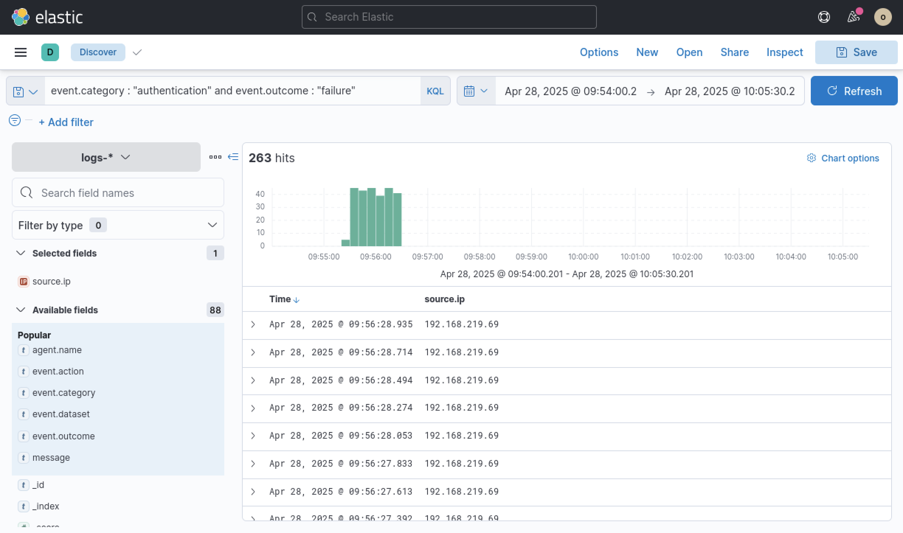
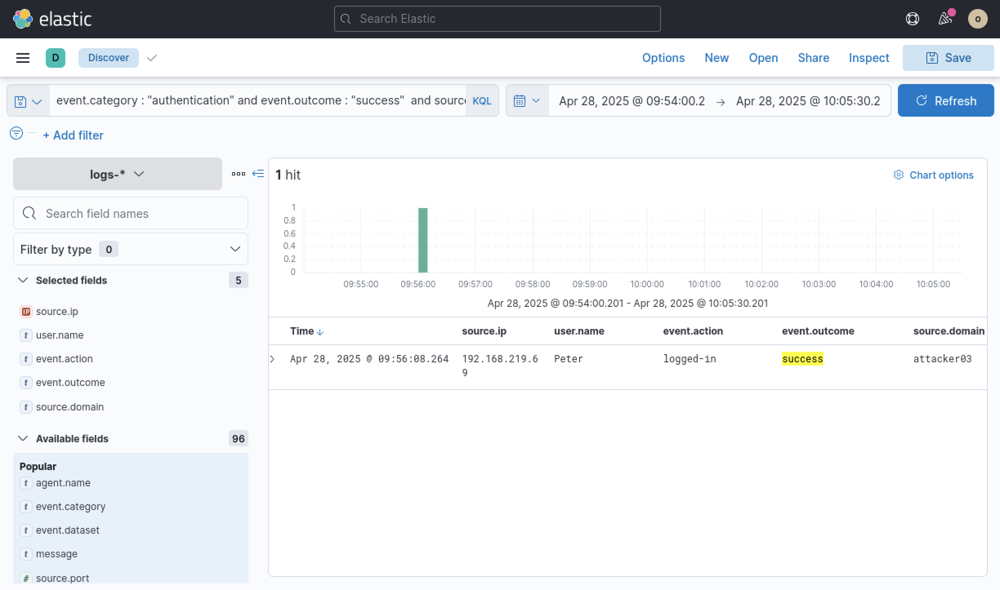
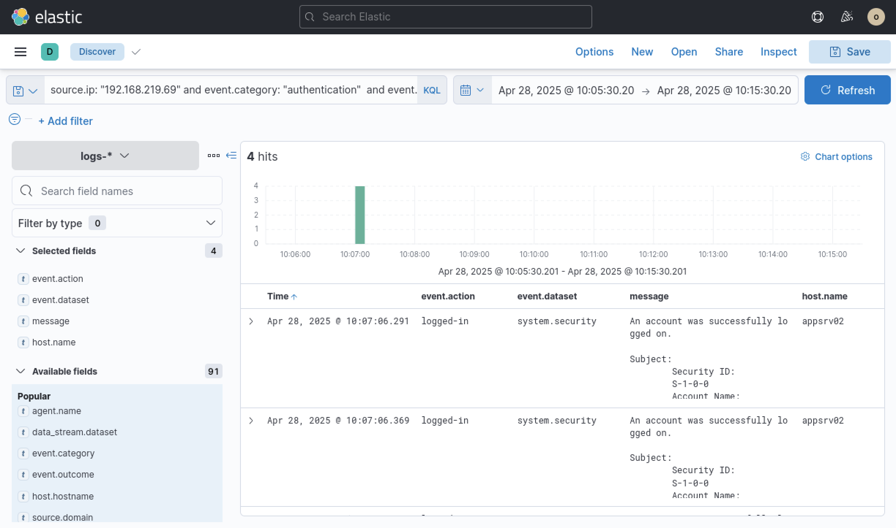
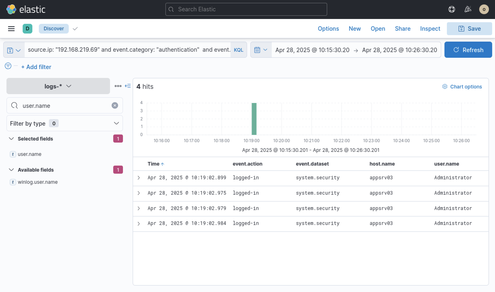

# Incident Investigation Report: Brute-Force Credential Spray, Privilege Escalation & Lateral Movement

**Target/Organization:** Enterprise Infrastructure Fleet

**Severity:** Critical

**Date of Incident:** April 28, 2025

**Prepared By:** Neel Soni

---

## Executive Summary

On **April 28, 2025**, an external threat actor initiated a coordinated brute-force credential spraying attack against internal application servers (`appsvr01`, `appsvr02`, and `appsvr03`).

Originating from source IP **`192.168.219.69`**, the adversary generated 263 authentication failures in a multi-second burst before successfully compromising the credentials for user **`Peter`**. Following initial access on host **`appsvr02`**, the attacker escalated local security contexts and subsequently pivoted laterally across the network to establish multiple concurrent **`Administrator`** sessions on **`appsvr03`**.

Immediate containment and eradication steps are required to isolate affected infrastructure, terminate compromised user sessions, and apply brute-force mitigation controls across all entry points.

---

## Indicators of Compromise (IoCs) & Incident Summary

| Category | Indicator / Detail | Description |
| --- | --- | --- |
| **Attacker Infrastructure** | `192.168.219.69` | Source IP utilized for brute-force attacks, initial compromise, and lateral movement |
| **Source Domain** | `attacker03` | Authentication source domain logged during initial compromise |
| **Compromised Accounts** | `Peter`, `Administrator` | Initial low-privilege access (`Peter`), lateral movement target (`Administrator`) |
| **Target Systems** | `appsvr01`, `appsvr02`, `appsvr03` | Application servers targeted during credential spraying and pivot activity |

---

## Detailed Technical Narrative & Incident Walkthrough

### Phase 1: Credential Access (Brute-Force & Credential Spraying)

The investigation began by querying ingested security logs in Elastic Security for authentication failure bursts during the timeframe between **09:54:00 and 10:05:30 UTC**. Telemetry was isolated using the KQL query:

```kql
event.category : "authentication" and event.outcome : "failure"
```

The search revealed a sudden peak of **263 authentication failures** concentrated around **09:56:00 UTC**, all originating from source IP **`192.168.219.69`**. Timestamps on individual failure logs show automated rapid-fire attempts occurring milliseconds apart (e.g., `09:56:27.392`, `09:56:27.613`, `09:56:28.935`), indicating the use of scripted password-guessing tools.

*Figure 1: Authentication failure telemetry capturing 263 rapid failed login attempts from source IP 192.168.219.69.*



---

### Phase 2: Initial Access (Compromise of User 'Peter')

Following the brute-force burst, the query was updated to locate successful logins originating from the attacker's IP address:

```kql
event.category : "authentication" and event.outcome : "success" and source.ip : "192.168.219.69"
```

At **09:56:08.264 UTC**, a successful authentication event was recorded. The threat actor successfully guessed the password for user account **`Peter`** from source domain **`attacker03`**, obtaining initial access to the internal network environment.

*Figure 2: Successful authentication event confirming initial access for user 'Peter' at 09:56:08 UTC.*



---

### Phase 3: Post-Compromise Activity & Elevation Context on appsvr02

To trace post-exploitation activity, the investigation window was advanced to **10:05:30 to 10:15:30 UTC**. Searching for authentication and system activity from source IP `192.168.219.69` yielded multiple success logs (`system.security` dataset) on target host **`appsvr02`**.

At **10:07:06.291 UTC** and **10:07:06.369 UTC**, four distinct `logged-in` security events were recorded on **`appsvr02`**. Detailed log messages indicated elevated privilege processing under `Security ID: S-1-0-0`, confirming that the attacker was actively establishing persistent interactive sessions and executing elevated commands on the host.

*Figure 3: System security events on appsvr02 documenting successful interactive logons and privilege context initialization.*



---

### Phase 4: Lateral Movement to Administrator on appsvr03

Continuing the timeline inspection into the **10:15:30 to 10:26:30 UTC** window, telemetry was queried for ongoing session activity from `192.168.219.69`.

At **10:19:02 UTC**, four simultaneous `logged-in` events were registered on a different host, **`appsvr03`**, under the **`Administrator`** user account:

* `10:19:02.899` — `appsvr03` (`Administrator`)
* `10:19:02.975` — `appsvr03` (`Administrator`)
* `10:19:02.979` — `appsvr03` (`Administrator`)
* `10:19:02.984` — `appsvr03` (`Administrator`)

This sequence confirms that after solidifying control over `appsvr02`, the adversary moved laterally across the network and compromised the primary administrative account on `appsvr03`, granting them full domain/system control over the server.

*Figure 4: Telemetry confirming successful lateral movement resulting in four concurrent Administrator sessions on appsvr03.*



---

## Threat Mapping (MITRE ATT&CK)

| Tactic | Technique ID | Technique Name | Applied Context |
| --- | --- | --- | --- |
| **Credential Access** | [T1110.001](https://attack.mitre.org/techniques/T1110/001/) | Brute Force: Password Guessing | Scripted password spray generating 263 failures from `192.168.219.69`. |
| **Initial Access** | [T1078](https://attack.mitre.org/techniques/T1078/) | Valid Accounts | Gained initial access as `Peter` via valid credential compromise. |
| **Privilege Escalation** | [T1068](https://attack.mitre.org/techniques/T1068/) | Exploitation for Privilege Escalation | Initial post-exploitation privilege elevation on `appsvr02` at 10:07 UTC. |
| **Lateral Movement** | [T1078.002](https://attack.mitre.org/techniques/T1078/002/) | Valid Accounts: Domain Accounts | Authenticated as `Administrator` on `appsvr03` from `appsvr02`/attacker IP at 10:19 UTC. |

---

## Comprehensive Remediation & Guidance

### 1. Immediate Containment Action Plan

* **Host Isolation:** Immediately isolate `appsvr02` and `appsvr03` from the internal network segment to stop active C2 and secondary lateral movement.
* **Perimeter Firewall Blocking:** Block all inbound and outbound traffic to/from source IP **`192.168.219.69`**.
* **Account Disablement & Credential Invalidation:**
* Immediately disable user account **`Peter`** and terminate all associated active sessions.
* Force an immediate credential reset for the local/domain **`Administrator`** account and purge active Kerberos tickets (TGT/TGS) or NTLM sessions.


### 2. Eradication & Hardening

* **Account Lockout Thresholds:** Configure Active Directory Group Policy (GPO) or local security policies to enforce account lockouts (e.g., lock accounts for 15 minutes after 5 consecutive failed login attempts within 5 minutes).
* **Multi-Factor Authentication (MFA):** Require MFA for all remote access mechanisms, terminal servers, and privileged command executions.
* **Network Segmentation & Admin Restrictions:** Enforce explicit firewall policies preventing direct host-to-host lateral administrative management (e.g., restrict SMB/WinRM/RDP between application servers).

### 3. SIEM Detection Engineering Rules

* **Alert Rule 1 (Brute-Force Detection):** Trigger a high-severity alert when $\ge 20$ authentication failure events occur from a single `source.ip` within a 1-minute window across `system.security` or `system.auth` datasets.
* **Alert Rule 2 (Immediate Success After Brute-Force):** Create a correlation rule that triggers a critical incident when a successful logon occurs from an IP address that generated a Brute-Force alert within the preceding 15 minutes.
* **Alert Rule 3 (Administrative Lateral Movement):** Trigger a high-priority alert when an `Administrator` logon originates from non-jumpbox/non-admin IP ranges or standard user workstations.