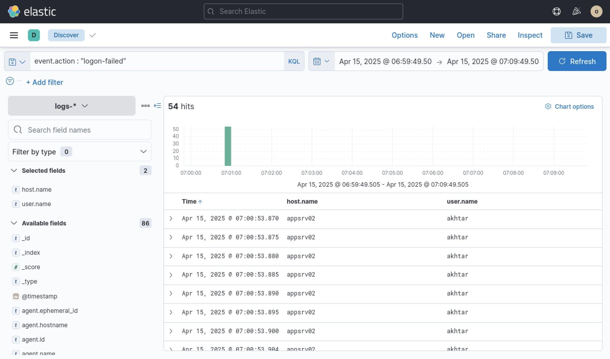
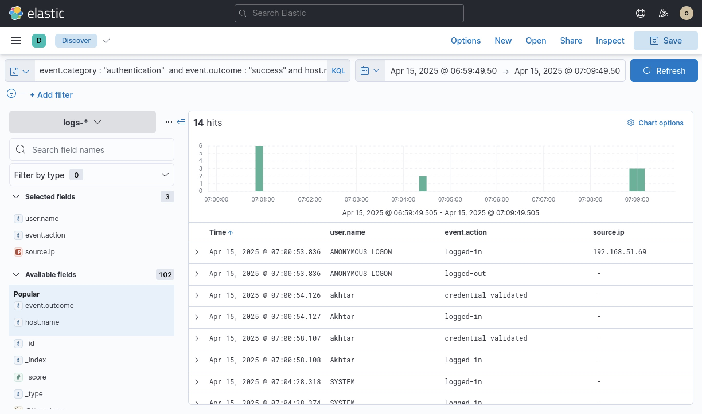
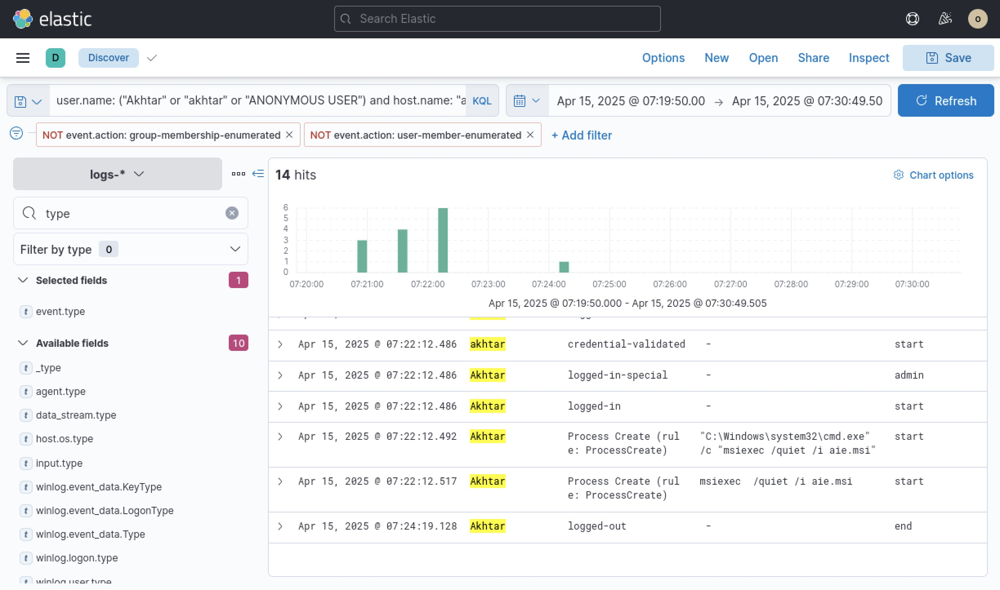

# Incident Investigation Report: Credential Spraying, Unauthorized Access & Malicious MSI Execution

**Target/Organization:** Enterprise Server Infrastructure

**Severity:** Critical

**Date of Incident:** April 15, 2025

**Prepared By:** Neel Soni

---

## Executive Summary

On **April 15, 2025**, an adversary executed a multi-stage intrusion targeting the Windows application server **`appsrv02`**.

Originating from source IP **`192.168.51.69`**, the threat actor performed a high-velocity password-guessing attack against user account **`akhtar`**. Immediately following the brute-force activity, an unauthenticated session (`ANONYMOUS LOGON`) was established, rapidly followed by valid credential validation for user `akhtar`. Once initial access was secured, the adversary executed administrative commands to launch a silent installer payload (`aie.msi`) via `msiexec`, indicating malicious software installation and local system compromise.

Immediate containment measures are required to isolate `appsrv02`, revoke the compromised credentials, purge unapproved software installations, and review system integrity for persistent backdoors.

---

## Indicators of Compromise (IoCs) & Incident Summary

| Category | Indicator / Detail | Description |
| --- | --- | --- |
| **Attacker Infrastructure** | `192.168.51.69` | Source IP for initial reconnaissance, brute-force, and anonymous access |
| **Target System** | `appsrv02` | Windows Server 2019 instance target |
| **Compromised Accounts** | `akhtar`, `ANONYMOUS LOGON` | Target user account (`akhtar`) and baseline null-session vector |
| **Malicious Payload / Process** | `aie.msi` / `msiexec /quiet /i aie.msi` | Silent MSI package installation executed via elevated command shell |

---

## Detailed Technical Narrative & Incident Walkthrough

### Phase 1: Credential Access (Rapid Logon Failure Burst)

The investigation began by querying ingested Windows security event logs in Elastic Security between **06:59:49 and 07:09:49 UTC** for failed authentication attempts using the KQL query:

```kql
event.action : "logon-failed"
```

The search returned **54 logon failure events** on host **`appsrv02`** targeting the account **`akhtar`**. All 54 failures occurred within a sub-second burst around **07:00:53 UTC** (e.g., timestamps `07:00:53.870`, `07:00:53.875`, `07:00:53.880`), pointing directly to automated password spraying or brute-force tools targeting user credentials.

*Figure 1: Authentication failure logs in Elastic Discover demonstrating 54 sub-second failed logon attempts for user 'akhtar'.*


---

### Phase 2: Initial Access & Anonymous Reconnaissance

To identify whether the attacker succeeded following the failure burst, successful authentication events on `appsrv02` were queried:

```kql
event.category : "authentication" and event.outcome : "success" and host.name: "appsrv02"

```

At **07:00:53.836 UTC**, two concurrent **`ANONYMOUS LOGON`** events (`logged-in` and `logged-out`) were captured from source IP **`192.168.51.69`**, indicating unauthenticated enumeration or Null Session probes.

Fewer than 300 milliseconds later (**07:00:54.126 UTC**), the system logged a `credential-validated` and subsequent `logged-in` event for user **`akhtar`**. Secondary logins for `akhtar` were observed again at **07:00:58 UTC**, confirming that the adversary successfully obtained valid account credentials and established authenticated access to `appsrv02`.

*Figure 2: Authentication success telemetry confirming ANONYMOUS LOGON from 192.168.51.69 followed immediately by successful logon for user 'akhtar'.*


---

### Phase 3: Privilege Elevation & Silent Payload Execution

Advancing the timeline to **07:19:50 to 07:30:49 UTC**, post-exploitation activities under account `akhtar` were interrogated using the query:

```kql
user.name: ("Akhtar" or "akhtar" or "ANONYMOUS USER") and host.name: "appsrv02"
```

At **07:22:12.486 UTC**, user `akhtar` triggered an elevated special logon session (`logged-in-special`), gaining administrative privilege context on the host. Immediately following this administrative elevation, process creation logs recorded two suspicious execution events:

1. **`07:22:12.492 UTC`**: A command shell (`cmd.exe`) was spawned to invoke the Windows Installer service:
```cmd
"C:\Windows\system32\cmd.exe" /c "msiexec /quiet /i aie.msi"
```


2. **`07:22:12.517 UTC`**: The Windows Installer binary executed the silent payload:
```cmd
msiexec /quiet /i aie.msi
```


The execution of `msiexec` with the `/quiet` switch suppresses installer UI elements, hiding installation activities from interactive users while deploying unverified binaries or persistence scripts.

*Figure 3: Process execution logs revealing elevated command shell spawning a silent MSI installer payload ('aie.msi').*


---

## Threat Mapping (MITRE ATT&CK)

| Tactic | Technique ID | Technique Name | Applied Context |
| --- | --- | --- | --- |
| **Credential Access** | [T1110.001](https://attack.mitre.org/techniques/T1110/001/) | Brute Force: Password Guessing | Automated burst of 54 logon failure events targeting `akhtar`. |
| **Initial Access** | [T1078.003](https://attack.mitre.org/techniques/T1078/003/) | Valid Accounts: Local Accounts | Authenticated access obtained via compromised local user account `akhtar`. |
| **Privilege Escalation** | [T1068](https://attack.mitre.org/techniques/T1068/) | Exploitation for Privilege Escalation | Elevation to special privileged session (`logged-in-special`) at 07:22 UTC. |
| **Defense Evasion** | [T1218.007](https://attack.mitre.org/techniques/T1218/007/) | System Binary Proxy Execution: Msiexec | Executed payload silently using `msiexec /quiet /i aie.msi` to evade user detection. |

---

## Comprehensive Remediation & Guidance

### 1. Immediate Containment Action Plan

* **Host Isolation:** Remove `appsrv02` from the network segment to prevent potential C2 callbacks or secondary lateral movement.
* **Account Revocation:** Disable user account `akhtar`, terminate active interactive or background sessions, and revoke active tokens/Kerberos tickets.
* **IP Perimeter Block:** Add `192.168.51.69` to network firewall and perimeter edge drop lists.
* **Process & File Eradication:** Locate and remove `aie.msi` along with any software packages installed during the incident window. Inspect registry keys (`HKLM\SOFTWARE\Microsoft\Windows\CurrentVersion\Uninstall` and Run keys) for persistence.

### 2. Hardening & Prevention

* **Software Restriction / Application Whitelisting:** Enforce Windows Defender Application Control (WDAC) or AppLocker policies to prevent standard/elevated accounts from running unverified `.msi` or `.ps1` installers from non-standard paths.
* **Account Lockout Policy:** Configure local/domain GPO account lockout controls (e.g., lock account after 5 failed login attempts within 5 minutes).
* **Restrict Null Sessions:** Disable SMB/NetBIOS null session authentication (`ANONYMOUS LOGON`) across all server endpoints (`RestrictedNullSessAccess=1`).

### 3. SIEM Detection Engineering Rules

* **Alert Rule 1 (Rapid Failed Logons):** Alert when $\ge 10$ failed authentication attempts (`event.action: "logon-failed"`) occur for a single user account within 1 minute.
* **Alert Rule 2 (Silent MSI Execution):** Trigger a high-priority alert on any process creation event where `image` ends in `msiexec.exe` and `process.args` contains both `/quiet` (or `/qn`) and `/i`.
* **Alert Rule 3 (Anonymous Access Correlation):** Flag any instance where an `ANONYMOUS LOGON` event from an external IP is followed by a successful user authentication from the same network segment within 5 minutes.