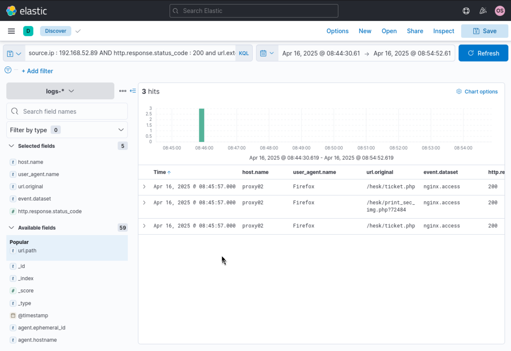
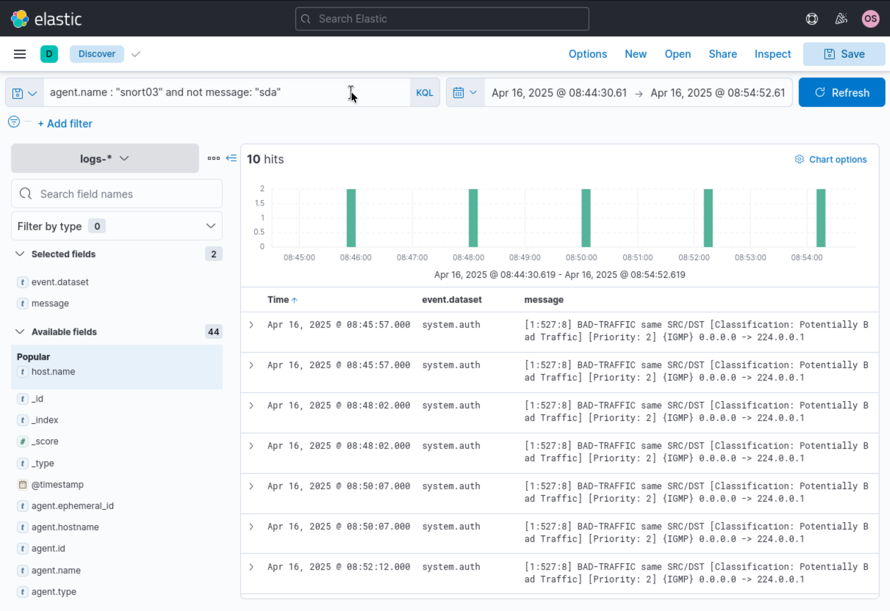
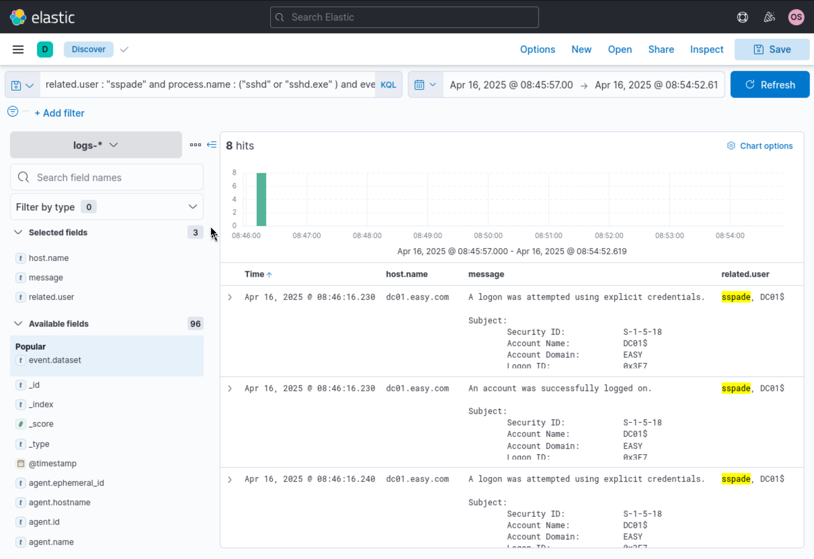
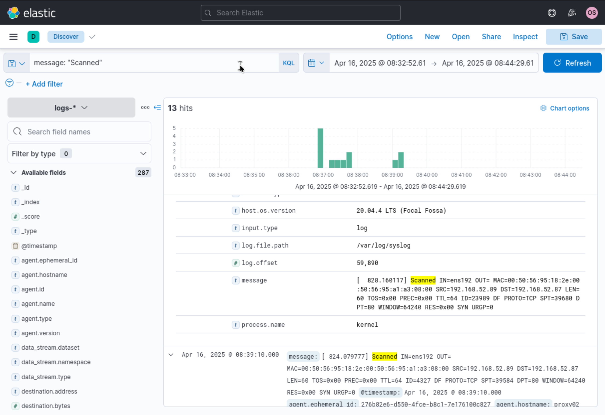
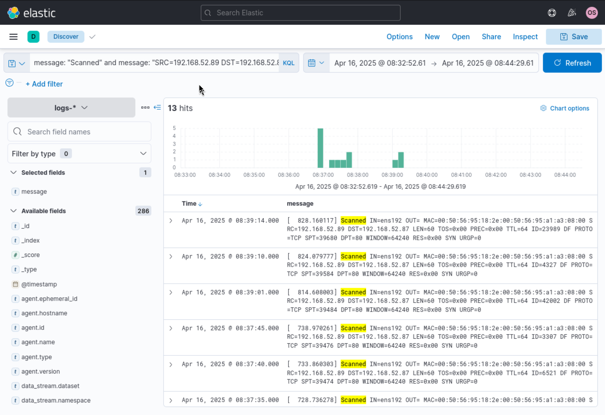
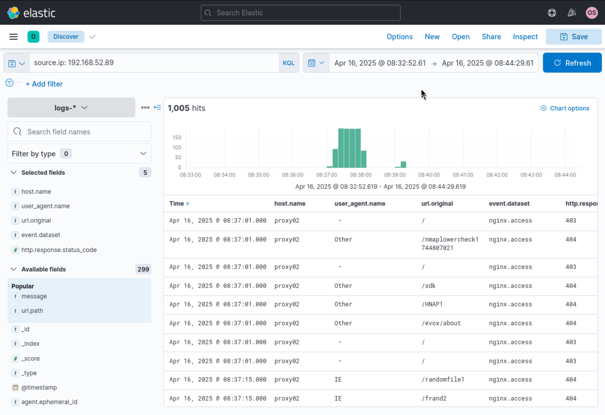
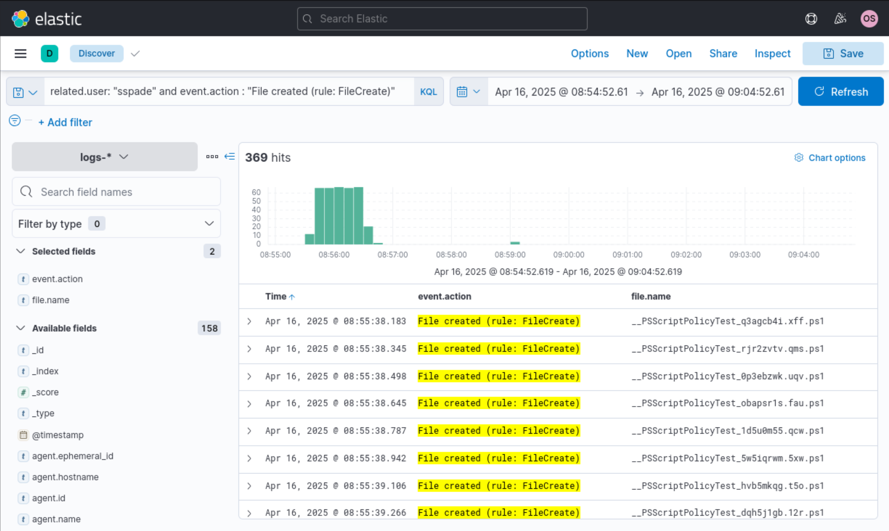
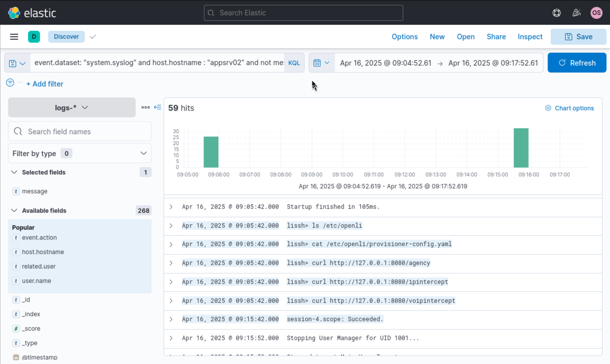
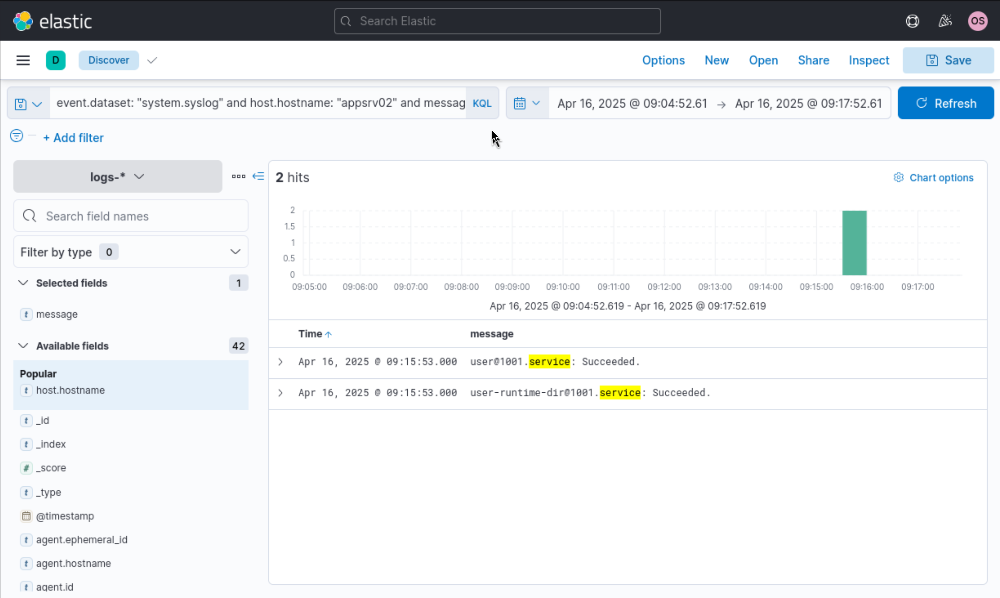

# Incident Investigation Report: Web Reconnaissance, Password Spraying & Interception Service Targeting

**Target Network:** Enterprise Infrastructure Fleet

**Severity:** Critical

**Date of Incident:** April 16, 2025

**Prepared By:** Neel Soni

---

## Network Architecture & Topology

The target environment is split into two primary security zones: an **External/DMZ Network (`192.168.xx.xx`)** housing edge proxy and IDS assets, and a segmented **Internal Network (`172.16.xx.xx`)** housing enterprise application servers, SIEM logging, and core domain controllers.

*Figure 1: Target enterprise network topology displaying DMZ boundary controls and internal segmented infrastructure.*


### External / DMZ Network (`192.168.xx.xx`)

* **Attacker System:** `192.168.52.89` (External)
* **Edge Proxy Server (`proxy02`):** `192.168.xx.87` (Nginx Ingress Proxy)
* **Intrusion Detection Sensor (`snort03`):** `192.168.xx.88` (Network IDS)

### Internal Network (`172.16.xx.xx`)

* **Domain Controller (`dc01`):** `172.16.xx.80` (Active Directory Domain Controller)
* **Application Server 01 (`appsrv01`):** `172.16.xx.81` (Internal Application Node)
* **Application Server 02 (`appsrv02`):** `172.16.xx.82` (Linux Server hosting OpenLI Interception Services)
* **Web Server 02 (`web02`):** `172.16.xx.83` (Internal Web App Host)
* **SIEM Host (`siem05`):** `172.16.xx.85` (Centralized Logging Stack)

---

## Executive Summary

On **April 16, 2025**, an adversary executed a multi-phase cyber intrusion targeting sensitive enterprise infrastructure and specialized telecom interception services.

Originating from external IP **`192.168.52.89`**, the adversary performed web endpoint discovery against DMZ edge proxy **`proxy02`** (`192.168.xx.87`), successfully discovering exposed HESK helpdesk endpoints. Network IDS sensors recorded concurrent security alerts during the probe window. The attacker leveraged compromised valid domain credentials (**`sspade`**) to authenticate against internal Domain Controller **`dc01`** (`172.16.xx.80`), executing an automated domain password spraying attack (`Invoke-DomainPasswordSpray`) that generated hundreds of transient PowerShell script artifacts.

Subsequently, the threat actor pivoted via SSH using account **`akhtar`** onto **`appsrv02`** (`172.16.xx.82`), executing targeted reconnaissance against internal OpenLI telecom interception configurations and local API endpoints.

Immediate containment, credential revocation across impacted domain accounts, and perimeter network isolation are required.

---

## Indicators of Compromise (IoCs) & Incident Summary

| Category | Indicator / Detail | Description |
| --- | --- | --- |
| **Attacker IP** | `192.168.52.89` | External source IP for web enumeration, initial staging, and network probing |
| **Target DMZ Proxy** | `proxy02` (`192.168.xx.87`) | Ingress proxy node targeted for web enumeration and HTTP probing |
| **Compromised Accounts** | `sspade`, `akhtar` | Domain user (`sspade`) used for password spraying; local account (`akhtar`) used for interception reconnaissance |
| **Targeted Internal Hosts** | `dc01` (`172.16.xx.80`), `appsrv01` (`172.16.xx.81`), `appsrv02` (`172.16.xx.82`) | Compromised internal infrastructure targeted for credential spraying and OpenLI auditing |
| **Malicious Scripts & Tools** | `Invoke-DomainPasswordSpray`, `__PSScriptPolicyTest_*.ps1` | PowerSploit module used to automate domain account credential spraying |
| **Targeted Files / Endpoints** | `/hesk/ticket.php`, `/etc/openli/provisioner-config.yaml` | Exposed helpdesk endpoint (`proxy02`) and sensitive telecom configuration files (`appsrv02`) |

---

## Detailed Technical Narrative & Incident Walkthrough

### Phase 1: Ingress Web Discovery & Endpoint Identification

The investigation began by auditing HTTP access logs on edge proxy host **`proxy02`** (`192.168.xx.87`) in Elastic Security between **08:44:30 and 08:54:52 UTC**:

```kql
source.ip : 192.168.52.89 AND http.response.status_code : 200 and url.extension : "php"

```

At **08:45:57.000 UTC**, telemetry recorded successful HTTP `200 OK` responses originating from external IP **`192.168.52.89`**. The requests identified valid PHP endpoints associated with an internal HESK helpdesk application:

* `/hesk/ticket.php`
* `/hesk/print_sec_img.php?72484`

*Figure 2: HTTP access log telemetry highlighting successful identification of exposed HESK application scripts on proxy02.*


---

### Phase 2: Intrusion Detection Alerts (Snort IDS Alerts)

During the same timeframe (**08:44:30 to 08:54:52 UTC**), network intrusion detection logs were queried for sensor **`snort03`** (`192.168.xx.88`):

```kql
agent.name : "snort03" and not message: "sda"

```

`snort03` triggered 10 priority-2 security alerts (`system.auth` dataset) capturing abnormal packet signatures classified as `BAD-TRAFFIC same SRC/DST` (e.g., timestamps `08:45:57`, `08:48:02`, `08:50:07`, `08:52:12`). This confirms network layer traffic anomalies during the adversary's probing activities.

*Figure 3: Snort03 IDS alerts capturing bad-traffic signatures generated during external probing.*


---

### Phase 3: Domain Access & Explicit Authentication on DC01

Transitioning to internal network telemetry (`172.16.xx.xx`), authentication logs were queried on primary Domain Controller **`dc01`** (`172.16.xx.80`):

```kql
related.user : "sspade" and process.name : ("sshd" or "sshd.exe")

```

At **08:46:16.230 UTC**, security event logs on `dc01` recorded a successful logon attempt using explicit credentials for domain user **`sspade`** (`Security ID: S-1-5-18`, Subject Account `DC01$`):

* `A logon was attempted using explicit credentials.`
* `An account was successfully logged on.`

This event confirms that the threat actor obtained valid credentials for user `sspade` and successfully authenticated into the Active Directory domain environment.

*Figure 4: Security event telemetry on dc01 confirming user sspade authenticating via explicit credentials.*


---

### Phase 4: Session Teardown & Service Teardown on Linux Application Node

While auditing system daemon activity across Linux application servers (`appsrv02`), daemon logs (`system.syslog`) were interrogated for process execution and service events:

```kql
event.dataset: "system.syslog" and host.hostname : "appsrv02"

```

At **09:15:53.000 UTC**, systemd service logs recorded the completion of user runtime manager instances:

* `user@1001.service: Succeeded`
* `user-runtime-dir@1001.service: Succeeded`

This telemetry captured automated session termination and user runtime cleanup following administrative command execution.

*Figure 5: Systemd service logs confirming user session completion and daemon teardown on appsrv02.*



---

### Phase 5: Kernel Firewall Telemetry & Network Scan Analysis

To trace the initial network reconnaissance phase preceding web discovery, kernel firewall logs were queried on `proxy02` between **08:32:52 and 08:44:29 UTC**:

```kql
message: "Scanned"

```

The logs captured 13 distinct port scan hits recorded by kernel firewall modules (`ens192` interface) originating from external IP **`192.168.52.89`** targeting destination IP **`192.168.52.87`** on port 80.

*Figure 6: Syslog telemetry on proxy02 displaying overall network scanning log hits originating from 192.168.52.89.*



Applying a specific source/destination filter:

```kql
message: "Scanned" and message: "SRC=192.168.52.89 DST=192.168.52.87"

```

isolated sequential TCP SYN scan packets (e.g., timestamps `08:37:35`, `08:37:40`, `08:37:45`, `08:39:01`, `08:39:10`, `08:39:14`), confirming deliberate, automated port scanning against the edge proxy.

*Figure 7: Interrogated kernel message logs capturing sequential TCP SYN scan packets directed at port 80.*



---

### Phase 6: Automated Web URI Enumeration

Expanding the web log query across `proxy02` during the scan window (**08:32:52 to 08:44:29 UTC**):

```kql
source.ip: 192.168.52.89

```

revealed **1,005 HTTP request hits** in `nginx.access` logs. The adversary executed automated web crawler/fuzzer tools, probing non-existent URIs resulting in HTTP `404 Not Found` and `403 Forbidden` status codes (e.g., `/nmaplowercheck`, `/sdk`, `/HNAP1`, `/evox/about`, `/randomfile1`).

*Figure 8: Nginx web access logs on proxy02 demonstrating high-volume automated URI enumeration.*



---

### Phase 7: Domain Password Spraying Execution

Following initial access on the internal domain, Sysmon process creation and file modification events were analyzed between **08:54:52 and 09:04:52 UTC**:

```kql
related.user: "sspade" and event.action : "File created (rule: FileCreate)"

```

The search revealed **369 file creation hits** executed under account `sspade`. Between **08:55:38 and 08:59:00 UTC**, the adversary executed `Invoke-DomainPasswordSpray` (PowerSploit framework), which generated hundreds of temporary policy test scripts (e.g., `__PSScriptPolicyTest_q3agcb4i.xff.ps1`, `__PSScriptPolicyTest_rjr2zvtv.qms.ps1`) in `C:\Users\sspade\AppData\Local\Temp`.

*Figure 9: Sysmon FileCreate events capturing 369 transient PowerShell script creations during password spray execution.*



---

### Phase 8: Targeted Interception Service Reconnaissance on `appsrv02`

Following the password spray attack, syslog telemetry was interrogated on **`appsrv02`** (`172.16.xx.82`) between **09:04:52 and 09:17:52 UTC**:

```kql
event.dataset: "system.syslog" and host.hostname : "appsrv02"

```

At **09:05:42.000 UTC**, user account **`akhtar`** logged in via SSH and executed interactive commands in an administrative shell (`lissh`), targeting OpenLI (Open Lawful Intercept) configurations and local API services:

1. `lissh> ls /etc/openli` — Enumerated OpenLI configuration directory.
2. `lissh> cat /etc/openli/provisioner-config.yaml` — Inspected lawful interception provisioner settings.
3. `lissh> curl [http://127.0.0.1:8080/agency](http://127.0.0.1:8080/agency)` — Interrogated agency API endpoints.
4. `lissh> curl [http://127.0.0.1:8080/ipintercept](http://127.0.0.1:8080/ipintercept)` — Interrogated IP interception service endpoints.
5. `lissh> curl [http://127.0.0.1:8080/voipintercept](http://127.0.0.1:8080/voipintercept)` — Interrogated VoIP interception service endpoints.

*Figure 10: System syslog telemetry capturing interactive shell commands auditing OpenLI telecom interception configs and APIs on appsrv02.*



---

## Threat Mapping (MITRE ATT&CK)

| Tactic | Technique ID | Technique Name | Applied Context |
| --- | --- | --- | --- |
| **Reconnaissance** | [T1046](https://attack.mitre.org/techniques/T1046/) | Network Service Scanning | Port scanning `proxy02` (`192.168.xx.87`) from external IP `192.168.52.89` (Screenshots 5, 6). |
| **Initial Access** | [T1190](https://attack.mitre.org/techniques/T1190/) | Exploit Public-Facing Application | Probing and discovering HESK application endpoints (`/hesk/ticket.php`) (Screenshots 1, 7). |
| **Execution** | [T1059.001](https://attack.mitre.org/techniques/T1059/001/) | Command and Scripting Interpreter: PowerShell | Executed `Invoke-DomainPasswordSpray` generating 369 `.ps1` artifacts (Screenshot 8). |
| **Credential Access** | [T1110.003](https://attack.mitre.org/techniques/T1110/003/) | Brute Force: Password Spraying | Automated domain password spraying using compromised account `sspade` across internal subnet `172.16.xx.xx`. |
| **Discovery** | [T1087.002](https://attack.mitre.org/techniques/T1087/002/) | Account Discovery: Domain Account | Authenticated on `dc01` (`172.16.xx.80`) and enumerated domain accounts (Screenshot 3). |
| **Discovery / Collection** | [T1005](https://attack.mitre.org/techniques/T1005/) | Data from Local System | Reading sensitive OpenLI config (`provisioner-config.yaml`) and querying local interception APIs on `appsrv02` (`172.16.xx.82`) (Screenshot 9). |

---

## Comprehensive Remediation & Guidance

### 1. Immediate Containment Action Plan

* **Internal Host Isolation:** Immediately isolate internal hosts **`appsrv01`** (`172.16.xx.81`), **`appsrv02`** (`172.16.xx.82`), and **`dc01`** (`172.16.xx.80`) from the internal switch to prevent further horizontal pivot while preserving memory states.
* **Perimeter Firewall Blocking:** Add `192.168.52.89` to drop rules on the DMZ perimeter firewall enforcing strict boundaries between `192.168.xx.xx` and `172.16.xx.xx`.
* **Account Disablement & Credential Reset:**
* Disable domain user accounts **`sspade`** and **`akhtar`**.
* Purge active Kerberos TGT/TGS tickets and force domain-wide password resets for accounts evaluated during the spray window.


### 2. Eradication & System Hardening

* **DMZ Proxy Hardening:** Patch the HESK helpdesk application on `proxy02` (`192.168.xx.87`) and restrict public web access to administrative script paths.
* **PowerShell Execution Controls:** Enforce Constrained Language Mode (CLM) and deploy AppLocker/WDAC rules across all internal Windows servers to block script execution from `%TEMP%` directories.
* **Segmented Access & SSH Hardening:** Restrict internal SSH management on `appsrv02` (`172.16.xx.82`) to dedicated administrative hosts, enforcing key-based authentication with strict access ACLs.

### 3. SIEM Detection Engineering Rules

* **Alert Rule 1 (PowerShell Temp Script Staging):** Trigger a critical alert when $>10$ file creation events matching `__PSScriptPolicyTest_*.ps1` occur within 1 minute under standard user profiles.
* **Alert Rule 2 (High-Volume Web Enumeration):** Alert when an external IP generates $>50$ HTTP $404/403$ responses within 3 minutes on DMZ edge proxies.
* **Alert Rule 3 (Lawful Intercept / OpenLI Access):** Trigger an immediate high-priority alert whenever non-administrative users access `/etc/openli/*` or query localhost ports associated with interception services (`8080/agency`, `8080/ipintercept`).