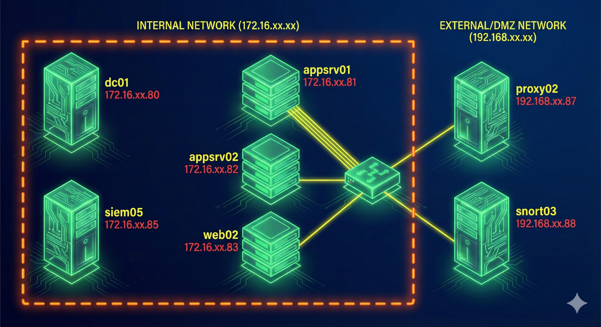

# Incident Report: Unauthorized Access and Password Spraying Attempt  

## Executive Summary  
On April 16, 2025, an attacker originating from IP **192.168.52.89** conducted reconnaissance and exploitation activities targeting the corporate network. The attack began with external scanning of the proxy server (**proxy02**) and progressed to credential-based access on multiple internal systems, culminating in a password spraying attempt against domain accounts. The intrusion leveraged SSH connections, PowerShell scripts, and reconnaissance of sensitive telecom interception services, indicating a high-value target compromise attempt.  

### Network Diagram


## Investigation  
- **Detection Source**: Elastic Security SIEM, Snort03 IDS, Syslog from appsrv02  
- **Queries Used**:  
  ```kql
  # Detect scanning activity
  message: "Scanned"  
  message: "Scanned" and message: "SRC=192.168.52.89 DST=192.168.52.87"  

  # Identify attacker IP activity
  source.ip: 192.168.52.89  
  source.ip: 192.168.52.89 and http.response.status_code : 200  
  source.ip : 192.168.52.89 AND http.response.status_code : 200 and url.extension : "php"  

  # Track user activity
  related.user : "sspade"  
  related.user: "sspade" and event.action: "File created (rule: FileCreate)"  
  related.user: "sspade" and process.name: "powershell.exe"  

  # SSH authentication events
  agent.name: ("appsrv02" or "web02") and event.category: "authentication" and event.outcome: "success"  
  ```  

- **Observed Behavior**:  
  - **08:32–08:44**: Attacker scanned proxy02 (192.168.52.87) 13 times from 192.168.52.89.  
  - **08:44–08:54**: Conducted 1000 HTTP requests to proxy02, enumerating endpoints and discovering PHP files, including `/hesk/ticket.php`.  
  - **08:46–09:04**: User `sspade` authenticated via Kerberos on **dc01** and **appsrv01**, executed SSH processes, and staged PowerShell scripts for password spraying.  
  - **08:55–08:59**: Built and executed `Invoke-DomainPasswordSpray` using PowerSploit framework; created `pass.txt` with 15 candidate passwords; cleaned up artifacts.  
  - **09:05**: User `akhtar` logged in via SSH on **appsrv02** from proxy02, performed reconnaissance on `/etc/openli` configs and internal APIs for interception services.  

## Findings  
- **Source IP / Host**:  
  - Attacker IP: **192.168.52.89**  
  - Proxy Host: **proxy02 (192.168.52.87)**  

- **Target Hosts / Accounts**:  
  - Hosts: **dc01**, **appsrv01**, **appsrv02**, **web02**  
  - Accounts: `sspade`, `akhtar`  

- **Indicators**:  
  - Multiple failed SSH attempts to appsrv02 and web02.  
  - Creation of 369 `.ps1` files in `C:\Users\sspade\AppData\Local\Temp`.  
  - PowerShell execution with **ExecutionPolicy Bypass**.  
  - IOC: `Invoke-DomainPasswordSpray` module, Base64-encoded script (`dps.b64`), suspicious URLs (`/hesk/ticket.php`).  

- **Outcome**:  
  - Successful compromise of **appsrv01** and **dc01**.  
  - Failed SSH attempts to appsrv02 and web02 by `sspade`.  
  - Successful SSH login on appsrv02 by `akhtar` followed by reconnaissance.  

## Detection Logic  
Alert triggered when:  
- More than **10 scanning events** from the same source within **15 minutes**.  
- PowerShell execution creating `.ps1` files in temp directory.  
- SSH login from non-standard account (`akhtar`) on sensitive host.  

## Recommendations  
- **Containment**:  
  - Block IP **192.168.52.89** at perimeter firewall.  
  - Disable accounts `sspade` and `akhtar`.  
  - Isolate compromised hosts (**appsrv01**, **appsrv02**, **dc01**) for forensic analysis.  

- **Preventive Measures**:  
  - Enforce MFA for all privileged accounts.  
  - Apply strict SSH access controls and disable unused accounts.  
  - Patch HESK helpdesk application and review exposed endpoints.  

- **Monitoring Improvements**:  
  - Add SIEM rules for PowerShell script staging and Base64 decoding.  
  - Implement alerts for abnormal SSH logins and Kerberos ticket requests.  
  - Enhance IDS signatures for reconnaissance on telecom interception services.  

## MITRE ATT&CK Mapping  
- **Technique**:  
  - T1190 – Exploit Public-Facing Application  
  - T1078 – Valid Accounts  
  - T1110.003 – Password Spraying  
  - T1059.001 – PowerShell  
  - T1087 – Account Discovery  
  - T1046 – Network Service Scanning  

- **Tactic**:  
  - Initial Access, Execution, Credential Access, Discovery, Lateral Movement  

## Lessons Learned  
- Early detection of scanning activity allowed timely investigation, but lack of SSH hardening enabled lateral movement.  
- Password spraying detection was successful; however, cleanup actions indicate gaps in forensic retention.  
- Future improvements:  
  - Implement real-time blocking for repeated scanning attempts.  
  - Strengthen monitoring of sensitive hosts (appsrv02) and telecom-related services.  
  - Automate correlation between web enumeration and credential-based attacks.  
  

