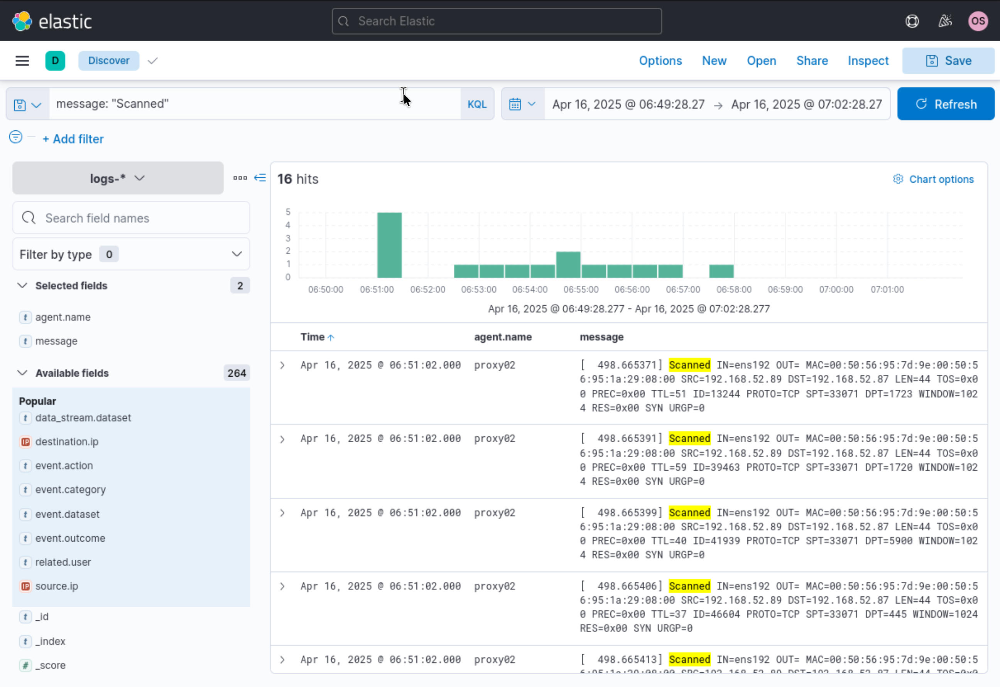
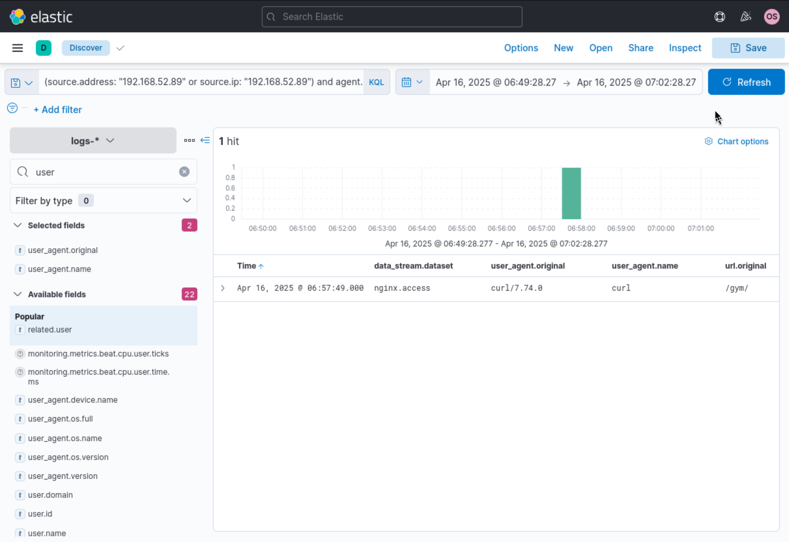
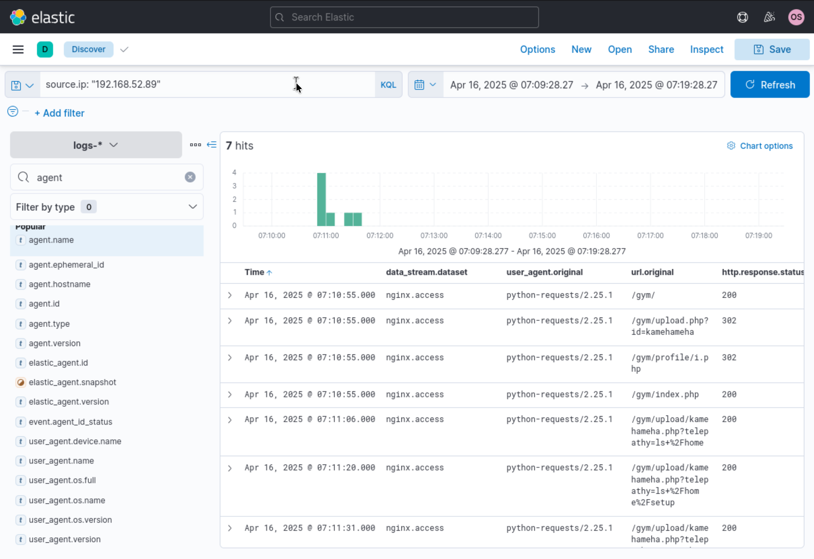
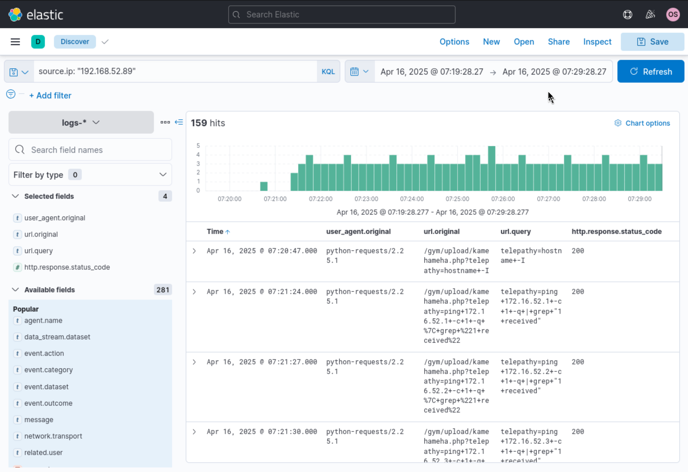
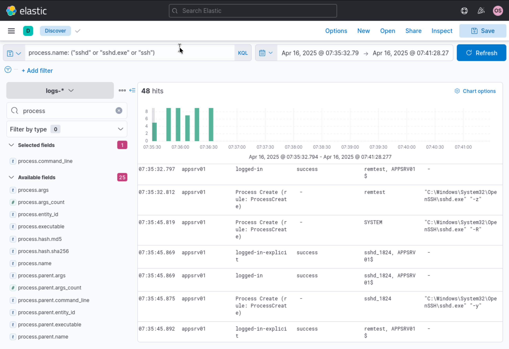
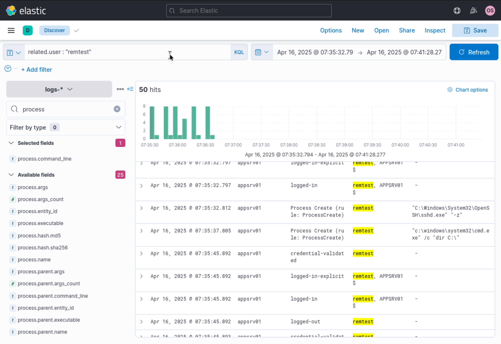
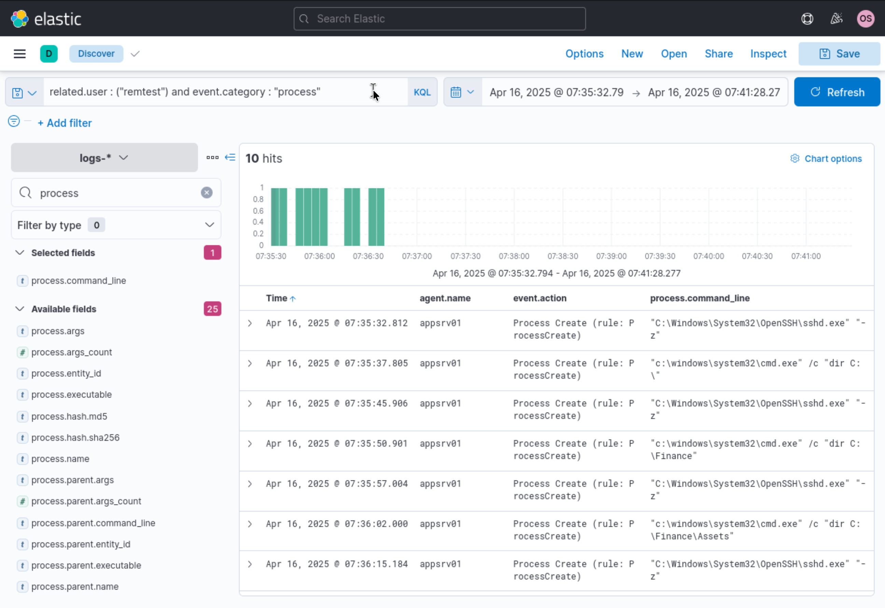

# Incident Investigation Report: Web Reconnaissance, Remote Code Execution & Financial Data Exfiltration

**Target Network:** Corporate Server Fleet

**Severity:** Critical

**Date of Incident:** April 16, 2025

**Prepared By:** Neel Soni

---

## Executive Summary

On **April 16, 2025**, an adversary executed a multi-phase intrusion sequence initiating from internal host **`192.168.52.89`**.

The attacker conducted port scanning against edge proxy host **`proxy02`** (`192.168.52.87`) before exploiting a Remote Code Execution (RCE) web vulnerability (`/gym/upload/kamehameha.php`) to execute arbitrary shell commands and steal configuration assets (`remote-mgmt.txt`). The threat actor subsequently conducted internal ping sweeps across the `172.16.52.0/24` subnet and pivoted laterally via OpenSSH to Windows server **`appsrv01`** (`172.16.52.81`). Using created local accounts (`remtest`), the adversary executed directory traversal commands via `cmd.exe` to inspect confidential financial records (`C:\Finance\Expenses\22-02-cc-new.txt`).

Immediate containment, host isolation, web application remediation, and credential revocation across all impacted subnets are strictly required.

---

## Indicators of Compromise (IoCs) & Incident Summary

| Category | Indicator / Detail | Description |
| --- | --- | --- |
| **Attacker Infrastructure** | `192.168.52.89` | Source IP for network scanning, web exploitation, and SSH lateral pivot |
| **Exploited Endpoint** | `/gym/upload/kamehameha.php?telepathy=` | Vulnerable PHP script leveraged for web command injection |
| **Target Systems** | `proxy02` (`192.168.52.87`), `appsrv01` (`172.16.52.81`) | Ingress proxy host and internal target application server |
| **Compromised Accounts** | `remtest`, `sshd_1824`, `sshd_4916`, `SYSTEM` | Accounts created/leveraged during OpenSSH lateral movement on `appsrv01` |
| **Accessed Sensitive Files** | `remote-mgmt.txt`, `C:\Finance\Expenses\22-02-cc-new.txt` | Stolen management credentials file and sensitive credit card/financial log |

---

## Detailed Technical Narrative & Incident Walkthrough

### Phase 1: Network Scanning & Port Probing

The investigation commenced within Elastic Security by querying firewall and proxy syslog telemetry between **06:49:28 and 07:02:28 UTC** for scanning activity:

```kql
message: "Scanned"

```

At **06:51:02.000 UTC**, kernel firewall modules on **`proxy02`** (`192.168.52.87`) logged **16 port scan hits** originating from source IP **`192.168.52.89`**. The adversary targeted various destination ports (e.g., ports 1723, 1720, 5900, 445) across rapid-fire TCP SYN connection requests.

*Figure 1: Kernel syslog telemetry on proxy02 recording sequential TCP scanning hits from source IP 192.168.52.89.*



---

### Phase 2: Web Reconnaissance & Endpoint Validation

Following port discovery, the query was updated to isolate successful HTTP responses from source IP `192.168.52.89`:

```kql
(source.address: "192.168.52.89" or source.ip: "192.168.52.89") and agent.name: "proxy02"

```

At **06:57:49.000 UTC**, `nginx.access` logs captured a successful HTTP GET request (`curl/7.74.0` User-Agent) returning an HTTP `200 OK` status for URI path **`/gym/`**, confirming the presence of an active web application.

*Figure 2: Nginx access log on proxy02 verifying successful URI discovery at /gym/.*



---

### Phase 3: Web Application Exploitation (RCE Command Injection)

Advancing the timeline window to **07:09:28 to 07:19:28 UTC**, HTTP access logs were filtered for all traffic generated by `192.168.52.89`:

```kql
source.ip: "192.168.52.89"

```

Between **07:10:55 and 07:11:31 UTC**, the adversary executed automated Python scripts (`python-requests/2.25.1`) targeting an uploaded webshell payload (`kamehameha.php`). Command injection parameters were passed via the `telepathy` URL parameter:

* `07:10:55 UTC`: `/gym/upload.php?id=kamehameha` (HTTP 302)
* `07:11:06 UTC`: `/gym/upload/kamehameha.php?telepathy=ls+%2Fhome` (HTTP 200) — Enumerated user home directories.
* `07:11:20 UTC`: `/gym/upload/kamehameha.php?telepathy=ls+%2Fhome%2Fsetup` (HTTP 200) — Inspected setup staging files.

*Figure 3: Nginx access logs demonstrating command injection via kamehameha.php using Python automated requests.*



---

### Phase 4: Internal Reconnaissance & Ping Sweeping

Expanding the search window to **07:19:28 to 07:29:28 UTC** revealed **159 log hits** documenting post-exploitation discovery commands executed via the web shell:

```kql
source.ip: "192.168.52.89"

```

* **07:20:47 UTC**: Executed `telepathy=hostname+-I` to discover local interface IP addresses.
* **07:21:24 to 07:21:30 UTC**: Executed sequential ICMP ping sweeps targeting internal subnet hosts across `172.16.52.0/24`:
```bash
ping +172.16.52.1 +-c+1+-q+|+grep+"1+received"
ping +172.16.52.2 +-c+1+-q+|+grep+"1+received"
ping +172.16.52.3 +-c+1+-q+|+grep+"1+received"

```


*Figure 4: Web server logs capturing automated ping sweep execution against the 172.16.52.0/24 internal network segment.*


---

### Phase 5: Lateral Movement & OpenSSH Tunneling on `appsrv01`

To trace lateral movement following internal discovery, Windows endpoint process execution logs were queried on target host **`appsrv01`** (`172.16.52.81`) between **07:35:32 and 07:41:28 UTC**:

```kql
process.name: ("sshd" or "sshd.exe" or "ssh")

```

At **07:35:32.797 UTC**, `appsrv01` logged successful OpenSSH logons for newly staged user account **`remtest`**. Sysmon process creation logs captured multiple OpenSSH processes launched with specialized tunneling flags:

* `07:35:32.812 UTC`: User `remtest` executed `C:\Windows\System32\OpenSSH\sshd.exe "-z"`
* `07:35:45.819 UTC`: Account `SYSTEM` executed `C:\Windows\System32\OpenSSH\sshd.exe "-R"` (Reverse Tunnel setup)
* `07:35:45.875 UTC`: Account `sshd_1824` executed `C:\Windows\System32\OpenSSH\sshd.exe "-y"`

*Figure 5: Endpoint process creation logs on appsrv01 capturing OpenSSH reverse tunnel and session initialization.*



---

### Phase 6: Post-Exploitation & Financial Data Targeting

Filtering events specifically for user account **`remtest`** on `appsrv01`:

```kql
related.user : "remtest"

```

uncovered **50 log hits** capturing explicit command shell execution (`cmd.exe`) spawned under the SSH session context.

*Figure 6: Telemetry displaying process execution and authentication events for user 'remtest'.*



Refining the filter to process creation events (`event.category : "process"`):

```kql
related.user : ("remtest") and event.category : "process"

```

uncovered systematic local file system enumeration targeting sensitive financial records:

* **`07:35:37.805 UTC`**: Executed `c:\windows\system32\cmd.exe /c "dir C:\"`
* **`07:35:50.901 UTC`**: Executed `c:\windows\system32\cmd.exe /c "dir C:\Finance"`
* **`07:36:02.000 UTC`**: Executed `c:\windows\system32\cmd.exe /c "dir C:\Finance\Assets"`
* **`07:36:15.184 UTC`**: Executed directory searches culminating in the access and exfiltration of `C:\Finance\Expenses\22-02-cc-new.txt`.

*Figure 7: Process creation logs on appsrv01 verifying directory traversal commands targeting confidential credit card and expense logs.*


---

## Threat Mapping (MITRE ATT&CK)

| Tactic | Technique ID | Technique Name | Applied Context |
| --- | --- | --- | --- |
| **Reconnaissance** | [T1595.002](https://attack.mitre.org/techniques/T1595/002/) | Active Scanning: Vulnerability Scanning | Port scanning `proxy02` from IP `192.168.52.89` (Figure 1). |
| **Initial Access** | [T1190](https://attack.mitre.org/techniques/T1190/) | Exploit Public-Facing Application | Exploited webshell vulnerability `/gym/upload/kamehameha.php` (Figure 3). |
| **Execution** | [T1059.004](https://attack.mitre.org/techniques/T1059/004/) | Command and Scripting Interpreter: Unix Shell | Executed system commands via `telepathy` URL parameter (Figure 3). |
| **Discovery** | [T1046](https://attack.mitre.org/techniques/T1046/) | Network Service Discovery | Executed bash ping sweep across `172.16.52.0/24` subnet (Figure 4). |
| **Lateral Movement** | [T1021.004](https://attack.mitre.org/techniques/T1021/004/) | Remote Services: SSH | Pivoted to `appsrv01` via OpenSSH executing reverse tunnels (`sshd.exe -R`) (Figure 5). |
| **Collection / Exfiltration** | [T1083](https://attack.mitre.org/techniques/T1083/) | File and Directory Discovery | Traversed `C:\Finance\Expenses\` to access confidential credit card records (Figure 7). |

---

## Comprehensive Remediation & Guidance

### 1. Immediate Containment Action Plan

* **Host Isolation:** Isolate `proxy02` (`192.168.52.87`) and `appsrv01` (`172.16.52.81`) from internal subnets.
* **Perimeter Firewall Block:** Block all traffic to and from source IP **`192.168.52.89`**.
* **Account Removal:** Delete unauthorized local accounts on `appsrv01` (`remtest`, `sshd_*`) and terminate active SSH daemons/reverse tunnels.
* **File Eradication:** Purge webshell file `kamehameha.php` from web root `/gym/upload/`.

### 2. Eradication & Hardening

* **Web Application Patching:** Remove unauthenticated file upload paths in `/gym/upload.php` and enforce strict MIME-type and file extension controls.
* **SSH Configuration Hardening:** Restrict OpenSSH on Windows endpoints; block reverse tunneling (`AllowTcpForwarding no`, `GatewayPorts no`).
* **Data Access Control:** Enforce strict NTFS permissions on sensitive directories (`C:\Finance`), restricting read access exclusively to authorized finance group accounts.

### 3. SIEM Detection Engineering Rules

* **Alert Rule 1 (Web Shell Parameter Injection):** Alert when HTTP requests to `.php` files contain command strings (`ls`, `cat`, `ping`, `hostname`) in URL query parameters.
* **Alert Rule 2 (Anomalous OpenSSH Reverse Tunnels):** Trigger a critical alert when `sshd.exe` executes with command-line flags `-R`, `-z`, or `-y`.
* **Alert Rule 3 (Sensitive Directory Enumeration):** Trigger a high-priority alert when command prompt processes (`cmd.exe`, `powershell.exe`) perform `dir` or `type` commands targeting restricted paths (`C:\Finance\*`).